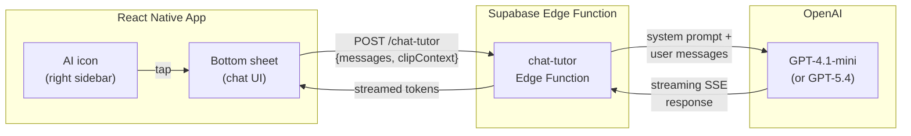

# AI Tutor Assistant

A contextual AI tutor that lives in the right-side action column of every clip. Tap the AI icon, a bottom sheet slides up to 50% screen height (video stays visible above), and you can ask questions about the code, problem, or concept being shown. Powered by OpenAI GPT-4.1-mini (with GPT-5.4 escalation for hard questions), proxied through a Supabase Edge Function so no API keys touch the client.

---

## Architecture



**Why a proxy?** API keys never leave the server. The Edge Function also handles:
- Authentication (only logged-in users can chat)
- Rate limiting (prevent abuse)
- Context injection (system prompt with clip/problem data)
- Model routing (cheap model for simple questions, expensive model for complex ones)

---

## Phase 1: Supabase Edge Function Proxy

### Commit 1: Create the `chat-tutor` Edge Function

```bash
supabase functions new chat-tutor
```

The function accepts a POST request with:

```typescript
interface ChatTutorRequest {
  messages: { role: "user" | "assistant"; content: string }[];
  clipContext: {
    clipId: string;
    problemTitle: string;
    problemNumber: number;
    difficulty: "Easy" | "Medium" | "Hard";
    topics: string[];
    transcript: string;       // full clip transcript
    codeSnippets: string[];   // extracted code blocks from transcript
  };
}
```

It builds a system prompt (see Phase 2), prepends it to the messages array, and calls OpenAI's chat completions endpoint with `stream: true`. The streaming response is forwarded directly to the client as an SSE stream.

Edge Function skeleton (Deno):

```typescript
import OpenAI from "https://esm.sh/openai@4";

const openai = new OpenAI({ apiKey: Deno.env.get("OPENAI_API_KEY") });

Deno.serve(async (req) => {
  const { messages, clipContext } = await req.json();

  const systemPrompt = buildSystemPrompt(clipContext);

  const stream = await openai.chat.completions.create({
    model: "gpt-4.1-mini",
    messages: [{ role: "system", content: systemPrompt }, ...messages],
    stream: true,
    max_tokens: 1024,
  });

  const encoder = new TextEncoder();
  const body = new ReadableStream({
    async start(controller) {
      for await (const chunk of stream) {
        const text = chunk.choices[0]?.delta?.content ?? "";
        if (text) {
          controller.enqueue(encoder.encode(`data: ${JSON.stringify({ text })}\n\n`));
        }
      }
      controller.enqueue(encoder.encode("data: [DONE]\n\n"));
      controller.close();
    },
  });

  return new Response(body, {
    headers: {
      "Content-Type": "text/event-stream",
      "Cache-Control": "no-cache",
      "Connection": "keep-alive",
    },
  });
});
```

### Commit 2: Add authentication guard

Verify the user's Supabase JWT before processing the request. Reject unauthenticated calls with 401.

```typescript
import { createClient } from "https://esm.sh/@supabase/supabase-js@2";

const supabase = createClient(
  Deno.env.get("SUPABASE_URL")!,
  Deno.env.get("SUPABASE_ANON_KEY")!
);

// Inside the handler:
const authHeader = req.headers.get("Authorization");
const { data: { user }, error } = await supabase.auth.getUser(
  authHeader?.replace("Bearer ", "")
);
if (error || !user) return new Response("Unauthorized", { status: 401 });
```

### Commit 3: Add rate limiting

Simple token-bucket rate limiter stored in Supabase:
- **Free tier**: 20 messages per day per user
- **Future premium**: unlimited

Track usage in a `tutor_usage` table:

```sql
create table tutor_usage (
  user_id uuid references auth.users not null,
  date date not null default current_date,
  message_count int not null default 0,
  primary key (user_id, date)
);
```

Increment on each request. Return 429 if limit exceeded, with a message telling the user how many messages remain.

---

## Phase 2: Context Assembly

### Commit 4: Build the system prompt

The system prompt grounds the AI in the specific clip context. This is what makes it feel like a tutor who "watched the same video," not a generic chatbot.

```
You are LeetTok Tutor, an expert coding tutor embedded in a short-form video app.
The user is watching a clip about the following LeetCode problem:

**Problem**: #{problemNumber} - {problemTitle}
**Difficulty**: {difficulty}
**Topics**: {topics.join(", ")}

**Video transcript**:
{transcript}

**Code shown in the video**:
{codeSnippets.join("\n---\n")}

Rules:
- Answer questions about THIS specific problem and the approach shown in the video.
- Keep answers concise (2-4 paragraphs max). The user is on mobile.
- Use code blocks with syntax highlighting when showing code.
- If the user asks about time/space complexity, reference the specific approach in the video.
- If the user seems confused about a prerequisite concept (hash maps, trees, etc.),
  give a brief explanation before answering the main question.
- Never give away the full solution unprompted. Guide the user to think through it.
- Use Socratic questioning when appropriate: "What do you think would happen if..."
- You can reference specific moments from the transcript to ground your answers.
```

### Commit 5: Extract code snippets from transcripts

During the clipping pipeline (or as a post-processing step), extract code blocks from the transcript using a simple heuristic:
- Lines that look like code (contain `=`, `def `, `for `, `if `, `return`, `class `, `->`, `{`, etc.)
- Or use GPT-4.1-mini to extract code from the transcript in a separate pipeline step

Store extracted `code_snippets` as a JSON array on the `clips` table:

```sql
alter table clips add column code_snippets text[] default '{}';
```

If code snippets aren't available yet (pipeline hasn't run this step), the system prompt omits that section -- the transcript alone is usually sufficient.

---

## Phase 3: Bottom Sheet Chat UI

### Commit 6: Install @gorhom/bottom-sheet

```bash
npx expo install @gorhom/bottom-sheet react-native-reanimated react-native-gesture-handler
```

`@gorhom/bottom-sheet` v5 has:
- Smooth 60fps gesture-driven animations
- Built-in keyboard handling (critical for a chat input)
- FlatList/ScrollView support inside the sheet
- Snap points (50% and 85% of screen height)

### Commit 7: Build the `TutorSheet` component

`src/components/TutorSheet.tsx`:

```
+----------------------------------+
|         [video still visible]    |  <- top 50% of screen
+----------------------------------+
|  --- drag handle ---             |
|                                  |
|  LeetTok Tutor          [close]  |  <- header
|                                  |
|  [Explain this] [Time O(?)]     |  <- quick action chips
|  [Give me a hint] [Approach?]   |
|                                  |
|  User: Why does this use a      |
|         hash map?               |
|                                  |
|  Tutor: Great question! The     |
|  hash map lets us do O(1)       |  <- streaming, token by token
|  lookups for the complement...  |
|                                  |
|  +----------------------------+ |
|  | Ask about this problem...  | |  <- text input
|  +----------------------------+ |
+----------------------------------+
```

Key implementation details:
- **Snap points**: `["50%", "85%"]` -- starts at half screen, can drag up to near-full
- **Message list**: `BottomSheetFlatList` (gorhom's FlatList that works inside the sheet) with `inverted={true}` so newest messages appear at the bottom
- **Streaming display**: Append tokens to the last assistant message as they arrive. Use a ref to avoid re-renders on every token -- batch updates with `requestAnimationFrame`
- **Keyboard handling**: `BottomSheetTextInput` with `android_keyboardInputMode="adjustResize"`. The sheet auto-adjusts when keyboard opens.
- **Quick action chips**: Row of preset buttons above the chat. Tapping one sends a pre-built message:
  - "Explain this" -> "Can you explain the approach used in this video?"
  - "Time O(?)" -> "What is the time and space complexity of this solution?"
  - "Give me a hint" -> "Give me a hint about how to solve this problem without the full answer."
  - "Other approaches?" -> "What other approaches could solve this problem?"

### Commit 8: Build the streaming fetch client

`src/lib/tutor.ts`:

Since React Native doesn't natively support SSE/ReadableStream well, use the `react-native-sse` package or `react-native-polyfill-globals` with `textStreaming: true`:

```typescript
import EventSource from "react-native-sse";

export function streamTutorResponse(
  messages: Message[],
  clipContext: ClipContext,
  onToken: (token: string) => void,
  onDone: () => void,
  onError: (error: string) => void
) {
  // POST to Edge Function, read SSE stream
  const url = `${SUPABASE_URL}/functions/v1/chat-tutor`;

  fetch(url, {
    method: "POST",
    headers: {
      "Content-Type": "application/json",
      "Authorization": `Bearer ${session.access_token}`,
    },
    body: JSON.stringify({ messages, clipContext }),
    // @ts-ignore -- polyfill adds this
    reactNative: { textStreaming: true },
  }).then(async (response) => {
    const reader = response.body?.getReader();
    const decoder = new TextDecoder();

    while (reader) {
      const { done, value } = await reader.read();
      if (done) break;
      const text = decoder.decode(value);
      // Parse SSE data lines
      for (const line of text.split("\n")) {
        if (line.startsWith("data: ")) {
          const data = line.slice(6);
          if (data === "[DONE]") { onDone(); return; }
          const parsed = JSON.parse(data);
          onToken(parsed.text);
        }
      }
    }
  }).catch((err) => onError(err.message));
}
```

Fallback: If streaming proves unreliable on certain Android devices, fall back to a non-streaming request that returns the full response at once. The UI shows a typing indicator while waiting.

### Commit 9: Style messages with code highlighting

Messages from the tutor may contain markdown and code blocks. Render them with:
- `react-native-markdown-display` for markdown formatting
- `react-native-code-highlighter` (already needed for MadLeets) for syntax-highlighted code blocks
- Monospace font for inline code
- Dark bubble for user messages, slightly lighter bubble for tutor messages (matching the dark theme)

---

## Phase 4: Right Sidebar Integration

### Commit 10: Add AI tutor icon to the right action column

Update the right-side action column (defined in the mobile app plan, Phase 2 commit 7) to add an AI icon **at the top** of the column, above the creator avatar:

```
  [AI icon]        <- NEW: sparkles/brain icon, tap to open tutor sheet
  [Creator avatar]
  [Like + count]
  [Discuss + count]
  [Save + count]
  [Share + count]
  [Problem badge]
```

Icon options:
- Sparkles icon (`sparkles` from Ionicons) -- matches the "AI" feel
- Or a custom brain/chat-bubble icon

The icon should have a subtle glow or shimmer animation to draw attention on the first few views (then stop once the user has tapped it).

### Commit 11: Wire open/close behavior with video state

When the bottom sheet opens:
- **Pause the video** -- The user's attention is shifting to the chat. Auto-pause so they don't miss content.
- Pass the current clip's context (transcript, problem metadata, code snippets) to the `TutorSheet`

When the bottom sheet closes:
- **Resume the video** -- Pick up where they left off
- Keep the chat history in memory (so reopening shows the previous conversation for this clip)

When the user **swipes to a new clip**:
- Clear the chat history (new clip = new context)
- Close the bottom sheet if it's open

---

## Phase 5: Persistence, Limits, and Polish

### Commit 12: Persist chat history per clip

Store conversations in a `tutor_conversations` table:

```sql
create table tutor_conversations (
  id uuid primary key default gen_random_uuid(),
  user_id uuid references auth.users not null,
  clip_id uuid references clips not null,
  messages jsonb not null default '[]',
  created_at timestamptz default now(),
  updated_at timestamptz default now(),
  unique(user_id, clip_id)
);
```

When the user opens the tutor on a clip they've chatted about before, load the previous conversation. This lets users revisit explanations without re-asking.

### Commit 13: Show remaining message count + upgrade prompt

Display "X messages remaining today" at the top of the chat sheet. When the user hits the limit:
- Show a friendly message: "You've used all 20 tutor messages for today. Come back tomorrow!"
- Disable the input
- (Future: show an upgrade CTA for premium)

### Commit 14: Add quick-action chip buttons

The preset question chips from Commit 7, implemented as a horizontally scrollable row:

| Chip | Sends |
|------|-------|
| Explain this | "Can you explain the approach used in this video step by step?" |
| Time/Space | "What is the time and space complexity of this solution and why?" |
| Give me a hint | "I want to solve this myself. Give me a hint without revealing the full solution." |
| Other approaches | "What other approaches could solve this problem? How do they compare?" |
| Why this works | "Why does this specific approach work? What's the key insight?" |

Chips are only shown when the chat is empty (first interaction). After the first message, they collapse to save space but can be expanded via a "+" button.

### Commit 15: Analytics and iteration

Track tutor usage in the existing `interactions` table:
- `tutor_opened` event (which clip, timestamp)
- `tutor_message_sent` event (message length, was it a quick-action chip?)
- `tutor_session_duration` (how long the sheet was open)

This feeds into the recommendation engine: if a user frequently asks the tutor about DP problems, they might need more DP content at an easier difficulty level.

---

## Files Changed / Created

| File | Type | Description |
|------|------|-------------|
| `supabase/functions/chat-tutor/index.ts` | New | Edge Function: OpenAI proxy with auth + rate limiting |
| `supabase/migrations/xxx_tutor_tables.sql` | New | `tutor_usage` and `tutor_conversations` tables |
| `src/lib/tutor.ts` | New | Client-side streaming fetch + types |
| `src/components/TutorSheet.tsx` | New | Bottom sheet chat UI component |
| `src/components/TutorMessage.tsx` | New | Individual message bubble with markdown/code rendering |
| `src/components/QuickActionChips.tsx` | New | Preset question chip row |
| `src/components/VideoFeed.tsx` | Edit | Add AI icon to right sidebar, wire sheet open/close |
| `package.json` | Edit | Add @gorhom/bottom-sheet, react-native-sse or polyfill, react-native-markdown-display |

---

## Cost Estimate

| Component | Model | Cost |
|-----------|-------|------|
| Typical question (short context) | GPT-4.1-mini | ~$0.001-0.003 per message |
| Complex question (full transcript context) | GPT-4.1-mini | ~$0.005-0.01 per message |
| Escalated question | GPT-5.4 | ~$0.02-0.05 per message |

At 20 messages/day/user, mostly on GPT-4.1-mini: **~$0.05-0.10 per user per day**. Manageable at early scale. The rate limit keeps costs predictable.

---

## Dependencies on Other Plans

- **Mobile App** ([leettok_mobile_app.plan.md](.cursor/plans/leettok_mobile_app.plan.md)): Phase 2 (video feed + right sidebar) must exist so we can add the AI icon.
- **Clipping Engine** ([neetcode_clipping_engine.plan.md](.cursor/plans/neetcode_clipping_engine.plan.md)): Clip transcripts are the primary context source. The tutor works without `code_snippets` but is better with them.
- **MadLeets** ([madleets_interactive_challenges.plan.md](.cursor/plans/madleets_interactive_challenges.plan.md)): Optional integration -- if a user gets a MadLeets challenge wrong, the tutor could automatically offer to explain.
- **Supabase**: Must be set up with Edge Functions enabled. OpenAI API key stored as an Edge Function secret.
