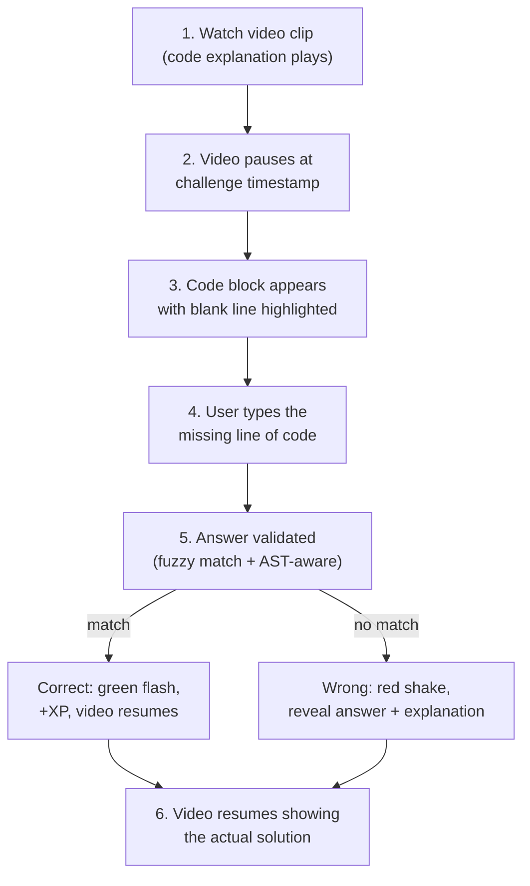
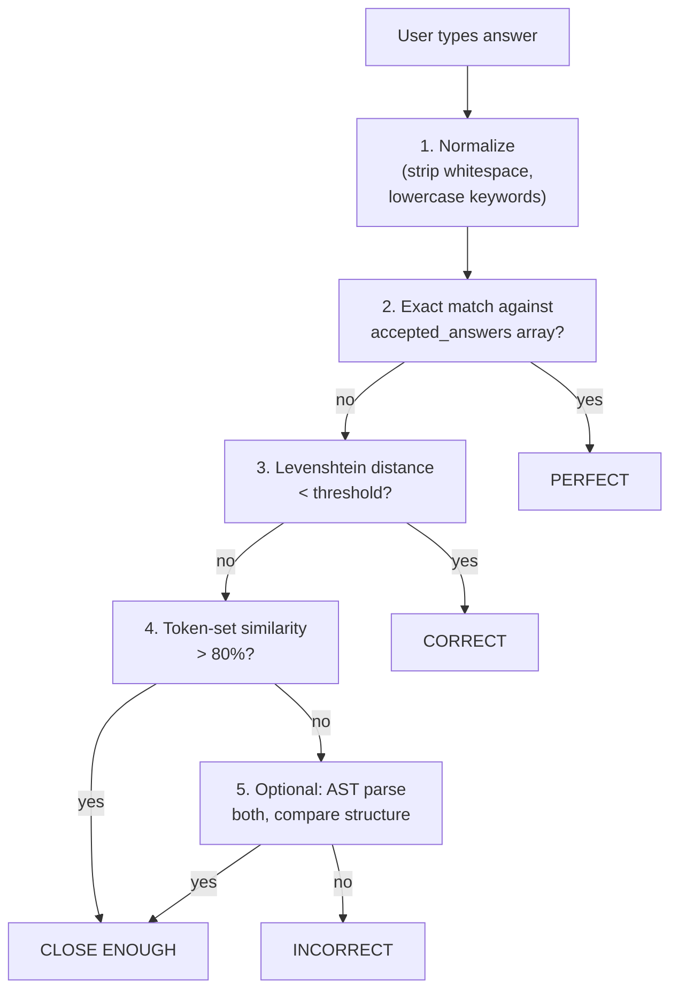

# MadLeets: Interactive Fill-in-the-Blank Challenges

**Name**: "MadLeets" -- like MadLibs, but for LeetCode. You fill in the blank line of code instead of a missing word. The name is instantly recognizable and fun.

This is a new interactive mode within LeetTok where videos pause at critical moments and the user must type the next line of code to continue. It transforms passive video watching into active recall -- the single most effective learning technique according to cognitive science research.

---

## The Core Loop



### Example Flow

A NeetCode clip about Two Sum is playing. The video explains the hash map approach:

> "So we iterate through the array, and for each number, we check if the complement exists in our hash map..."

The video **pauses**. A code block appears:

```python
def twoSum(nums, target):
    seen = {}
    for i, num in enumerate(nums):
        complement = target - num
        _______________________________   <-- type this line
        seen[num] = i
```

The user types: `if complement in seen: return [seen[complement], i]`

Green flash, +15 XP, the video resumes showing NeetCode writing that exact line.

---

## Design Principles

1. **Active recall over passive watching** -- Research shows active recall is 50% more effective than re-watching. Every clip becomes a quiz.
2. **Forgiving validation** -- Code can be written many ways. `if complement in seen:` and `if complement in seen :` and `if seen.get(complement) is not None:` should all be accepted. Use fuzzy matching + multiple accepted answers.
3. **The video IS the explanation** -- If the user gets it wrong, the video resumes and explains the answer. No separate "explanation" screen needed.
4. **Low friction** -- The challenge appears inline during the video. No mode switching, no separate screen. Swipe to skip if you just want to watch.
5. **Spaced repetition** -- Challenges you got wrong reappear later. Challenges you got right appear less frequently. The app learns what you need to practice.

---

## Phase 1: Pipeline Extension (Challenge Generation)

The clipping pipeline already produces transcripts and clip metadata. We extend it to also generate challenge data for each clip.

### Commit 1: Add challenge generation module

`pipeline/challenges.py`:

- Input: clip transcript, source code (extracted from transcript), video metadata
- Send to **GPT-4.1-mini** or **Claude Haiku 4.5** with a prompt that:
  1. Extracts the code being discussed in the clip
  2. Identifies the most educational line to blank out (the "aha moment" line)
  3. Generates the challenge

Prompt structure:

```
You are creating a "fill in the blank" coding challenge from a LeetCode
video clip transcript.

Video: "{title}" (LeetCode #{problem_number})
Transcript: {transcript}

Tasks:
1. Extract the complete code snippet being discussed in this clip.
2. Identify the single most important/educational line -- the line that
   represents the key insight, the clever trick, or the core algorithm step.
3. Generate a challenge where that line is blanked out.

Return JSON:
{
  "language": "python",
  "code_block": "the full code with all lines",
  "blank_line_index": 4,
  "blank_line_content": "if complement in seen: return [seen[complement], i]",
  "accepted_answers": [
    "if complement in seen: return [seen[complement], i]",
    "if complement in seen:\\n    return [seen[complement], i]",
    "if seen.get(complement) is not None: return [seen[complement], i]"
  ],
  "hint": "Check if we've already seen the number we need",
  "explanation": "We look up the complement in our hash map for O(1) lookup",
  "difficulty": "medium",
  "pause_timestamp": 34.5,
  "xp_value": 15,
  "tags": ["hash-map", "lookup", "two-sum"]
}
```

### Commit 2: Add code extraction from transcripts

`pipeline/code_extract.py`:

- Use LLM to extract code blocks from video transcripts
- NeetCode videos discuss code verbally ("so we create a hash map, then we iterate..."). The LLM reconstructs the actual code from the spoken description.
- Also attempt to extract code from YouTube video description (NeetCode often links to his code)
- Parse NeetCode.io for the problem's solution code as a reference
- This feeds into the challenge generator as source material

### Commit 3: Integrate challenge generation into the pipeline orchestrator

- After clipping + captioning, run challenge generation for each clip
- Store challenge data alongside clip metadata
- Some clips may not have good challenge candidates (e.g., pure explanation without code). The LLM should return `null` in those cases, and we skip them.

### Commit 4: Generate accepted answer variations

- For each challenge, generate 5-10 accepted answer variations:
  - Whitespace variations (spaces, tabs, newlines)
  - Equivalent syntax (`!= None` vs `is not None`, `range(len(arr))` vs `range(n)`)
  - Variable name flexibility (if the variable name is obvious from context)
- Store these as an array in the challenge data
- Also define a "similarity threshold" (Levenshtein distance) for fuzzy matching at runtime

---

## Phase 2: Database Schema

### Commit 5: Add challenges table to Supabase

```sql
create table challenges (
  id uuid primary key default gen_random_uuid(),
  clip_id uuid references clips(id) on delete cascade,
  problem_id uuid references problems(id),
  language text not null default 'python',
  code_block text not null,
  blank_line_index int not null,
  blank_line_content text not null,
  accepted_answers text[] not null,
  hint text,
  explanation text,
  difficulty text check (difficulty in ('easy', 'medium', 'hard')),
  pause_timestamp float not null,
  xp_value int not null default 10,
  tags text[],
  created_at timestamptz default now()
);

create table challenge_attempts (
  id uuid primary key default gen_random_uuid(),
  user_id uuid references users(id),
  challenge_id uuid references challenges(id),
  user_answer text not null,
  is_correct boolean not null,
  time_taken_ms int,
  attempted_at timestamptz default now()
);

create table user_progress (
  user_id uuid references users(id) primary key,
  total_xp int default 0,
  current_streak int default 0,
  longest_streak int default 0,
  challenges_completed int default 0,
  challenges_correct int default 0,
  last_challenge_at timestamptz
);
```

### Commit 6: Seed challenge data

- Manually create 10-15 high-quality challenges for testing
- Cover a range of difficulties and problem types (arrays, strings, trees, DP)
- Validate that all accepted answers actually work

---

## Phase 3: Core Challenge UI

This is the most complex part -- the interactive overlay that appears when a video pauses.

### Commit 7: Build MadLeetsOverlay component

The overlay slides up from the bottom when the video pauses at `pause_timestamp`:

```
+----------------------------------+
|                                  |
|   [Video - paused, dimmed]       |
|                                  |
+----------------------------------+
|  MadLeets Challenge              |
|                                  |
|  def twoSum(nums, target):      |
|      seen = {}                   |
|      for i, num in enumerate():  |
|          complement = target-num |
|  >   _________________________  |  <-- blinking cursor
|          seen[num] = i           |
|                                  |
|  Hint: "Check if we've seen..." |
|                                  |
|  [Submit]          [Skip -5 XP]  |
+----------------------------------+
|  [code keyboard / suggestions]   |
+----------------------------------+
```

- Uses `react-native-reanimated` for smooth slide-up animation
- Video dims to 30% opacity behind the overlay
- Code block uses monospace font with syntax highlighting via `react-native-code-highlighter`
- The blank line pulses gently to draw attention

### Commit 8: Build CodeInput component

A specialized text input for typing code on mobile:

- Monospace font (Courier New on iOS, monospace on Android)
- Dark background matching the code block theme
- Auto-indent to match the surrounding code context
- Character counter showing how close the answer length is
- No autocorrect, no spell check, no auto-capitalize

### Commit 9: Build answer validation logic

`src/lib/validate-answer.ts`:

- **Exact match**: Normalize whitespace and compare
- **Accepted answers**: Check against the array of pre-generated accepted answers
- **Fuzzy match**: Calculate Levenshtein distance. If distance < threshold (based on answer length), accept with a "close enough" message
- **Token-level comparison**: Split both answer and expected into tokens, compare token sets. This catches reordering issues.

Validation tiers:

1. Perfect match -> "Perfect!" + full XP
2. Accepted variation -> "Correct!" + full XP
3. Fuzzy match (>90% similar) -> "Close enough!" + 75% XP
4. Partial match (>60% similar) -> "Almost!" + show diff + 0 XP
5. No match -> "Not quite" + reveal answer + 0 XP

### Commit 10: Wire video pause + challenge trigger

- In the video player, monitor `player.currentTime` via a polling interval or `onPlaybackStatusUpdate`
- When `currentTime >= challenge.pause_timestamp`, call `player.pause()` and show the MadLeetsOverlay
- After the user submits (or skips), dismiss the overlay and call `player.play()` to resume
- Store the attempt in `challenge_attempts` table

### Commit 11: Build feedback animations

- **Correct answer**: Green border flash on the code input, confetti particles (use `react-native-confetti-cannon`), XP counter animates up (+15 XP), satisfying haptic feedback
- **Wrong answer**: Red shake animation on the input (translateX spring), the correct answer fades in below with a diff highlight showing what was different, gentle explanation text appears
- **Skip**: Input grays out, correct answer revealed with no fanfare, -5 XP penalty

### Commit 12: Add MadLeets toggle

- Not every user wants challenges interrupting their feed
- Add a toggle in settings: "MadLeets Challenges: On/Off"
- When off, videos play straight through without pausing
- When on, a small "MadLeets" badge appears on clips that have challenges

---

## Phase 4: Code Keyboard

Typing code on a phone keyboard is painful. We need a custom suggestion bar.

### Commit 13: Build CodeKeyboardBar component

A toolbar that sits above the system keyboard with common code tokens:

```
+------------------------------------------+
| if | for | return | in | def | ( | ) | : |
+------------------------------------------+
|           [standard keyboard]             |
+------------------------------------------+
```

- Tokens are context-aware: if the challenge is Python, show Python keywords. If Java, show Java keywords.
- Tapping a token inserts it at the cursor position with appropriate spacing
- Tokens are ordered by relevance to the current challenge (the LLM can suggest likely tokens in the challenge data)

### Commit 14: Add smart token suggestions

- Analyze the code context (surrounding lines) to suggest likely tokens
- E.g., if the line before is `for i in range(n):`, suggest `if`, `arr[i]`, `result`, `+=`
- Use a simple frequency analysis of the code block to surface variable names and function calls that already appear
- Display the 8 most likely tokens in the suggestion bar

---

## Phase 5: Gamification

### Commit 15: Build XP and leveling system

`src/lib/xp.ts`:

- Easy challenge correct: +10 XP
- Medium challenge correct: +15 XP
- Hard challenge correct: +25 XP
- Streak bonus: +5 XP per challenge in current streak (capped at +25)
- First attempt bonus: +5 XP if correct on first try
- Levels: Every 100 XP = 1 level. Display level badge on profile.

### Commit 16: Build streak tracker

- A challenge streak increments each day the user completes at least 1 challenge
- Display streak count prominently (fire icon + number, like Duolingo)
- Push notification at 8 PM if streak is about to break: "Your 7-day MadLeets streak is at risk!"
- Streak freeze: earned every 7 days, automatically preserves streak for 1 missed day

### Commit 17: Build progress stats screen

Show on the Profile tab:

- Total XP and level
- Current streak + longest streak
- Challenges completed / correct (accuracy %)
- Breakdown by topic (radar chart: Arrays 80%, Trees 45%, DP 20%, etc.)
- Breakdown by difficulty
- "Weakest topics" section suggesting what to practice

### Commit 18: Add review queue (spaced repetition)

- Challenges the user got wrong enter a review queue
- Reappear after 1 day, then 3 days, then 7 days (simplified spaced repetition)
- Challenges the user got right on first try are retired (don't reappear)
- A "Review" button on the home screen shows how many challenges are due

---

## Phase 6: Challenge Modes

### Commit 19: Daily Challenge mode

- One featured challenge per day, same for all users
- Leaderboard: ranked by time taken to answer correctly
- Available from the home screen as a prominent card

### Commit 20: Topic Drill mode

- User selects a topic (e.g., "Dynamic Programming") and difficulty
- Feed shows only clips with challenges matching that filter
- Great for targeted practice before interviews

### Commit 21: Challenge-only mode

- A separate tab or toggle that skips the video entirely
- Shows just the code block + blank, no video context
- Harder mode -- you don't get the verbal explanation first
- Awards 2x XP as a bonus for the added difficulty

---

## Answer Validation Deep Dive

This is the trickiest technical challenge. Code can be written many equivalent ways. Our validation needs to be smart but not require running code.

### Strategy: Multi-Layer Validation



- **Layer 1 (Normalization)**: Strip leading/trailing whitespace, collapse multiple spaces, normalize quotes (' vs "). This handles 80% of "almost right" answers.
- **Layer 2 (Exact match)**: Compare against the pre-generated accepted answers array. These are generated by the LLM during the pipeline phase.
- **Layer 3 (Fuzzy match)**: Levenshtein distance normalized by string length. Threshold: 90% similarity for full credit, 80% for partial credit.
- **Layer 4 (Token match)**: Tokenize both strings (split on whitespace, operators, punctuation). Compare token sets. If 80%+ tokens match, it's close enough.
- **Layer 5 (AST comparison, optional)**: For Python, we could use a lightweight parser to compare AST structure. This would catch `x != None` vs `x is not None`. Expensive to implement, save for later.

All validation runs client-side for instant feedback. No server round-trip needed.

---

## Mobile UX Considerations

- **Keyboard avoidance**: The code block must remain visible when the keyboard opens. Use `KeyboardAvoidingView` with `behavior="padding"`.
- **One-handed typing**: The suggestion bar provides common tokens so users don't need to hunt for symbols on the keyboard.
- **Screen real estate**: On smaller phones, the code block may need to be scrollable. Only show 5-7 lines with the blank line centered.
- **Haptics**: Use `expo-haptics` for tactile feedback on submit (success = medium impact, failure = light notch).
- **Accessibility**: Support VoiceOver/TalkBack for the code block. Read out line numbers and the blank prompt.

---

## Dependencies on Other Plans

- **Clipping Engine**: Phase 1 of this plan extends the pipeline in [neetcode_clipping_engine.plan.md](.cursor/plans/neetcode_clipping_engine.plan.md). The `pipeline/challenges.py` and `pipeline/code_extract.py` modules live alongside the existing pipeline modules.
- **Mobile App**: Phases 3-6 of this plan build on top of the video feed from [leettok_mobile_app.plan.md](.cursor/plans/leettok_mobile_app.plan.md). The MadLeetsOverlay integrates into the existing VideoFeed component.
- **Database**: The `challenges` and `challenge_attempts` tables are added to the shared Supabase schema.

This plan can begin after Phase 2 of both other plans is complete (once we have a working video feed and a working clipping pipeline).
