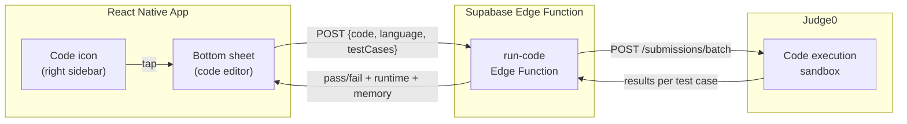

# Mobile Code Editor

A full LeetCode-style coding interface accessible from the right sidebar of any clip. Tap the code icon, video pauses, a bottom sheet slides up to 50% (expandable to 85%), and you can write a complete solution with syntax highlighting, a code-symbol toolbar, and execute it against test cases. Results show pass/fail per test case with runtime and memory stats.

---

## Architecture



**Why Judge0?**
- Open-source, self-hostable (Docker), or cheap cloud API
- Sandboxed execution with configurable time/memory limits
- 60+ languages supported (we need Python, Java, C++, JavaScript, TypeScript, Go)
- Batch submissions endpoint -- run all test cases in one API call
- Used by many online judges and coding platforms already

---

## Phase 1: Code Execution Backend

### Commit 1: Deploy Judge0 instance

Two options (choose based on scale):

**Option A -- Self-hosted (recommended for development + early users):**
```bash
docker-compose up -d  # Judge0 docker-compose from their repo
```
Deploy on a small VM (e.g., $5/mo DigitalOcean droplet or Railway). Judge0 runs as a Docker container with an API on port 2358.

**Option B -- Judge0 Cloud API (for quick start):**
Use Judge0's RapidAPI cloud. Free tier for development, Pro (€27/mo) for production. Requires no infra management but adds latency.

Either way, the Supabase Edge Function proxies all calls so the client never talks to Judge0 directly.

### Commit 2: Create `run-code` Supabase Edge Function

```typescript
// supabase/functions/run-code/index.ts
// Accepts: { code, language_id, test_cases: [{input, expected_output}] }
// Calls Judge0's /submissions/batch endpoint
// Returns: [{ passed, actual_output, expected_output, time, memory, status }]
```

The Edge Function:
1. Validates the request (auth required, rate limited)
2. Wraps the user's code with the appropriate driver (reads stdin, calls the solution function, prints output)
3. Sends a batch submission to Judge0 with all test cases
4. Polls for results (Judge0 is async -- submit, then poll /submissions/:token)
5. Returns structured results to the client

### Commit 3: Build language-specific code wrappers

The user writes a solution function (e.g., `def twoSum(self, nums, target)`). But Judge0 needs a complete program that reads from stdin and writes to stdout. The wrapper:

**Python example:**
```python
# User's code is injected here
{user_code}

# Driver code (generated per problem)
import sys, json
input_data = json.loads(sys.stdin.read())
nums = input_data["nums"]
target = input_data["target"]
result = Solution().twoSum(nums, target)
print(json.dumps(result))
```

Wrappers needed for: Python, JavaScript, TypeScript, Java, C++, Go. Each wrapper:
- Parses stdin as JSON (test case input)
- Calls the user's solution function
- Prints the result as JSON (for comparison with expected output)

Store wrapper templates on the Edge Function, keyed by language.

### Commit 4: Add rate limiting for code execution

Code execution is expensive (CPU time on the sandbox). Rate limit aggressively:
- **Free tier**: 10 submissions per day per user
- Track in a `code_execution_usage` table (same pattern as tutor rate limiting)

```sql
create table code_execution_usage (
  user_id uuid references auth.users not null,
  date date not null default current_date,
  submission_count int not null default 0,
  primary key (user_id, date)
);
```

---

## Phase 2: Test Case Data Model

### Commit 5: Extend the `problems` table with test cases and starter code

```sql
alter table problems add column starter_code jsonb default '{}';
-- { "python": "class Solution:\n    def twoSum(self, nums: List[int], target: int) -> List[int]:\n        ", 
--   "javascript": "var twoSum = function(nums, target) {\n    \n};", ... }

alter table problems add column test_cases jsonb default '[]';
-- [{ "input": {"nums": [2,7,11,15], "target": 9}, "expected_output": [0,1], "is_sample": true },
--  { "input": {"nums": [3,2,4], "target": 6}, "expected_output": [1,2], "is_sample": true },
--  { "input": {"nums": [3,3], "target": 6}, "expected_output": [0,1], "is_sample": false }]

alter table problems add column constraints text[];
-- ["2 <= nums.length <= 10^4", "-10^9 <= nums[i] <= 10^9", "Only one valid answer exists."]

alter table problems add column function_signature jsonb default '{}';
-- { "name": "twoSum", "params": [{"name": "nums", "type": "List[int]"}, {"name": "target", "type": "int"}], "return_type": "List[int]" }
```

- `is_sample: true` test cases are shown to the user in the editor
- Hidden test cases (`is_sample: false`) run on submission but inputs aren't revealed (like LeetCode)

### Commit 6: Seed test cases for initial problems

For each problem in the database, add:
- 2-3 sample test cases (visible in the editor)
- 5-10 hidden test cases (for full submission validation)
- Starter code in at least Python and JavaScript
- Function signature metadata

Source: LeetCode's public examples + edge cases generated by GPT-4.1-mini.

---

## Phase 3: Code Editor Bottom Sheet UI

### Commit 7: Build the `CodeEditorSheet` component

`src/components/CodeEditorSheet.tsx` -- a `@gorhom/bottom-sheet` (reuse the same library as the AI Tutor) with two tabs:

```
+----------------------------------+
|         [video visible above]    |
+----------------------------------+
|  --- drag handle ---             |
|                                  |
|  [Problem] [Code]     [Run ▶]   |  <- tab bar + run button
|                                  |
|  ┌────────────────────────────┐  |
|  │ 1│ class Solution:         │  |
|  │ 2│   def twoSum(self,      │  |
|  │ 3│     nums, target):      │  |
|  │ 4│     █                   │  |  <- cursor, user types here
|  │ 5│                         │  |
|  └────────────────────────────┘  |
|                                  |
|  +------------------------------+|
|  | { | } | ( | ) | [ | ] | ; |= ||  <- symbol toolbar
|  +------------------------------+|
|  |        [standard keyboard]    ||
|  +------------------------------+|
+----------------------------------+
```

**Tab: Problem** -- Shows the problem description:
- Problem title + number + difficulty badge
- Description text
- Sample test cases (input -> expected output)
- Constraints list

**Tab: Code** -- The actual editor:
- Syntax-highlighted code editor (`@rivascva/react-native-code-editor` or a custom `TextInput` with syntax highlighting overlay)
- Line numbers on the left
- Monospace font (JetBrains Mono or Fira Code)
- Dark theme (matches app aesthetic)
- Pre-loaded with the starter code for the selected language

### Commit 8: Build the syntax-highlighted code editor

Two approaches evaluated:

**Approach A -- `@rivascva/react-native-code-editor`**: Ready-made component with highlighting. Known cursor positioning issues on some devices (issue #13). Good enough for MVP.

**Approach B -- Custom `TextInput` + highlighting overlay**: A transparent `TextInput` for editing, with a separate `react-native-code-highlighter` view rendered behind it showing the highlighted version. More work but avoids the cursor bug. This is how many mobile code editors work.

Start with Approach A for speed. If cursor issues are a blocker, switch to B.

### Commit 9: Build the code symbol toolbar

Reuse and extend the `CodeKeyboardBar` concept from the [MadLeets plan](madleets_interactive_challenges.plan.md) (Phase 4, Commit 13):

```
+--------------------------------------------------+
|  Tab  | {  | }  | (  | )  | [  | ]  | =  |  →   |
+--------------------------------------------------+
|  ;    | :  | .  | ,  | "  | '  | !  | <  |  >   |
+--------------------------------------------------+
```

- Scrollable horizontally for more symbols
- **Context-aware**: If language is Python, emphasize `:`, `def`, `self`, `in`, `range`. If Java, emphasize `{`, `}`, `;`, `new`.
- Tapping a symbol inserts it at cursor position
- Special buttons:
  - **Tab**: Inserts 4 spaces (or 2, based on language convention)
  - **→** (arrow right): Moves cursor right (useful for escaping auto-completed brackets)

### Commit 10: Build the Problem tab

`src/components/ProblemDescription.tsx`:

- Markdown-rendered problem description (reuse `react-native-markdown-display`)
- Difficulty badge (green/yellow/red chip)
- Topic tags
- Sample test cases displayed in a clean format:

```
Example 1:
  Input: nums = [2,7,11,15], target = 9
  Output: [0,1]
  Explanation: nums[0] + nums[1] == 9

Example 2:
  Input: nums = [3,2,4], target = 6
  Output: [1,2]
```

- Constraints section
- "Solve on LeetCode" link (deep link to the problem on leetcode.com)

### Commit 11: Language picker

A small dropdown/pill in the code tab header:

```
[Python ▼]  |  [Reset]  |  [▶ Run]
```

Supported languages: Python, JavaScript, TypeScript, Java, C++, Go

Switching languages:
- Swaps to that language's starter code
- If the user has already written code for the current language, warn before switching ("You have unsaved code in Python. Switch anyway?")
- Remember the last-used language per user (store in AsyncStorage)

### Commit 12: Auto-indentation and bracket matching

Quality-of-life features that make mobile coding bearable:
- When user presses Enter after a `{` or `:`, auto-indent the next line
- When user types `(`, auto-insert `)` and place cursor between
- Same for `[`, `{`, `"`, `'`
- Highlight matching bracket when cursor is next to one

---

## Phase 4: Code Submission and Results

### Commit 13: Build the "Run" flow

When the user taps **Run**:
1. Extract the code from the editor
2. Show a loading indicator ("Running against sample test cases...")
3. Send to the `run-code` Edge Function with **only sample test cases** (fast feedback)
4. Display results inline below the editor

### Commit 14: Build the results display

`src/components/TestResults.tsx`:

```
+----------------------------------+
|  Results                         |
|                                  |
|  ✓ Test 1     2ms    4.2 MB     |  <- passed (green)
|    Input: [2,7,11,15], target=9  |
|    Expected: [0,1]               |
|    Output:   [0,1]               |
|                                  |
|  ✗ Test 2     1ms    4.1 MB     |  <- failed (red)
|    Input: [3,2,4], target=6      |
|    Expected: [1,2]               |
|    Output:   [2,1]               |
|                                  |
|  [Submit]                        |  <- runs ALL test cases (including hidden)
+----------------------------------+
```

Each test case shows:
- Pass/fail icon + color
- Runtime (ms)
- Memory usage (MB)
- Input, expected output, actual output (for failed cases, highlight the diff)

Error states:
- **Compilation Error**: Show the compiler error message with line number
- **Runtime Error**: Show the exception/error message
- **Time Limit Exceeded**: Show which test case timed out
- **Memory Limit Exceeded**: Show the memory cap

### Commit 15: Build the "Submit" flow

Tapping **Submit** runs the code against ALL test cases (sample + hidden):
- Loading: "Running against all test cases..."
- If all pass: success screen with confetti, runtime percentile ("Faster than 73% of submissions"), option to see other solutions
- If any fail: show which test cases failed (for hidden tests, show "Hidden test case failed" without revealing the input)

### Commit 16: Store submission history

```sql
create table submissions (
  id uuid primary key default gen_random_uuid(),
  user_id uuid references auth.users not null,
  problem_id uuid references problems not null,
  code text not null,
  language text not null,  -- "python", "javascript", etc.
  status text not null,    -- "accepted", "wrong_answer", "time_limit_exceeded", "runtime_error", "compile_error"
  runtime_ms int,
  memory_kb int,
  test_cases_passed int not null default 0,
  test_cases_total int not null default 0,
  created_at timestamptz default now()
);

create index idx_submissions_user_problem on submissions(user_id, problem_id);
```

Track every submission. This feeds into:
- Profile stats ("42 problems solved")
- The recommendation engine (solved problems are deprioritized)
- MadLeets difficulty calibration

---

## Phase 5: Right Sidebar Integration

### Commit 17: Add code icon to the right action column

Add a code/terminal icon to the right sidebar, positioned **below the AI tutor icon and above the creator avatar**:

```
  [AI Tutor]       <- sparkles icon (from AI tutor plan)
  [Code Editor]    <- NEW: terminal/code icon
  [Creator avatar]
  [Like + count]
  [Discuss + count]
  [Save + count]
  [Share + count]
  [Problem badge]
```

The icon should only appear on clips that have an associated problem with test cases. For clips without problem data, the icon is hidden.

### Commit 18: Wire open/close with video and other sheets

- Tapping the code icon **pauses the video** and opens the editor sheet
- If the AI tutor sheet is already open, close it first (only one sheet at a time)
- Closing the editor **resumes the video**
- The editor pre-loads the problem and starter code for the clip's associated problem
- Swiping to a new clip closes the editor but **preserves the user's code in memory** -- if they swipe back, their code is still there
- If the user has already solved this problem, show their last accepted solution instead of starter code

---

## Phase 6: Polish and Extras

### Commit 19: Language preference persistence

- Store the user's preferred language in AsyncStorage
- New editors default to this language
- The language picker remembers the choice across sessions

### Commit 20: Solution history per problem

On the Problem tab, add a "My Submissions" section:
- List of past submissions (date, status, runtime)
- Tap to load a previous submission into the editor
- Green checkmark next to the problem if it's been accepted

### Commit 21: Editorial solutions

After a user solves a problem (or gives up), unlock the editorial:
- Optimal solution with explanation
- Written by GPT-5.4 or human-curated
- Multiple approaches if applicable (brute force, optimal, etc.)

Store in a `solutions` table:

```sql
create table solutions (
  id uuid primary key default gen_random_uuid(),
  problem_id uuid references problems not null,
  approach_name text not null,        -- "Hash Map", "Two Pointer", "Brute Force"
  language text not null,
  code text not null,
  explanation text not null,           -- markdown
  time_complexity text,                -- "O(n)"
  space_complexity text,               -- "O(n)"
  sort_order int not null default 0
);
```

### Commit 22: "Ask Tutor about this" bridge

If the user is stuck in the code editor, add a button that opens the AI Tutor sheet with pre-filled context:
- "I'm stuck on problem #1 Two Sum. Here's my code so far: [user's code]. I'm getting [error/wrong answer on test 2]. Can you help?"
- This bridges the code editor and the AI tutor into a seamless experience

---

## UX Considerations for Mobile Coding

- **Keyboard management**: The bottom sheet + keyboard takes up most of the screen. The video shrinks to a thin strip at the top but remains visible (user can reference the explanation). At 85% snap, the video is essentially hidden and the editor is near-full-screen.
- **Font size**: Default to 13px monospace. Pinch-to-zoom on the editor to resize (capped at 10px-20px).
- **Auto-save**: Save the user's code to AsyncStorage every 5 seconds. If the app crashes or the user navigates away, their code is preserved.
- **Landscape mode**: On tablets or if the user rotates to landscape, show a true side-by-side layout (problem on left, editor on right) instead of tabs.
- **Haptics**: Success haptic on accepted submission, error haptic on failed.
- **Accessibility**: VoiceOver/TalkBack support for the editor (announce line numbers, syntax elements).

---

## Files Changed / Created

| File | Type | Description |
|------|------|-------------|
| `supabase/functions/run-code/index.ts` | New | Edge Function: Judge0 proxy with auth + rate limiting |
| `supabase/functions/run-code/wrappers.ts` | New | Language-specific code wrapper templates |
| `supabase/migrations/xxx_code_editor.sql` | New | `code_execution_usage`, `submissions`, `solutions` tables; extend `problems` |
| `src/components/CodeEditorSheet.tsx` | New | Bottom sheet with Problem/Code tabs |
| `src/components/CodeEditor.tsx` | New | Syntax-highlighted editable code component |
| `src/components/CodeSymbolBar.tsx` | New | Symbol toolbar above keyboard (extends MadLeets' CodeKeyboardBar) |
| `src/components/ProblemDescription.tsx` | New | Problem tab with description, examples, constraints |
| `src/components/TestResults.tsx` | New | Test case results display (pass/fail, runtime, memory) |
| `src/components/LanguagePicker.tsx` | New | Language dropdown/pill |
| `src/lib/codeExecution.ts` | New | Client-side API for submitting code and polling results |
| Right sidebar component | Edit | Add code icon, wire sheet open/close |
| `package.json` | Edit | Add @rivascva/react-native-code-editor (or code highlighting deps) |

---

## Cost Estimate

| Component | Cost |
|-----------|------|
| Judge0 self-hosted (small VM) | ~$5-10/mo |
| Judge0 cloud API (Pro tier) | €27/mo for 2K submissions/day |
| Supabase Edge Function invocations | Included in free tier |
| Test case storage | Negligible (small JSON) |

At 10 submissions/day/user, self-hosted Judge0 on a $10/mo VM handles ~100 concurrent users comfortably. Scale by adding more workers or upgrading the VM.

---

## Dependencies on Other Plans

- **Mobile App** ([leettok_mobile_app.plan.md](.cursor/plans/leettok_mobile_app.plan.md)): Phase 2 (video feed + right sidebar) and Phase 4 (Supabase + problems table) must exist.
- **AI Tutor** ([ai_tutor_assistant.plan.md](.cursor/plans/ai_tutor_assistant.plan.md)): Optional but recommended. Commit 22 bridges the two features. Also shares `@gorhom/bottom-sheet`.
- **MadLeets** ([madleets_interactive_challenges.plan.md](.cursor/plans/madleets_interactive_challenges.plan.md)): The `CodeKeyboardBar` / `CodeSymbolBar` concept is shared. Build once, use in both.
- **Clipping Engine** ([neetcode_clipping_engine.plan.md](.cursor/plans/neetcode_clipping_engine.plan.md)): Clips must be associated with problems (via `problem_id` on the `clips` table) for the code icon to appear.
