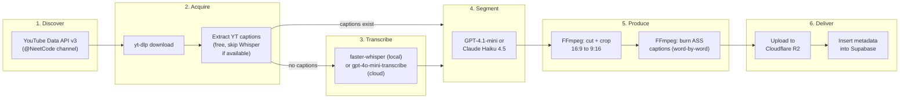

# NeetCode Clipping Engine

Standalone Python pipeline in `pipeline/` at the repo root. Connects to the LeetTok mobile app only through shared storage (Cloudflare R2) and database (Supabase). Can be built and tested entirely independently.

Repo: `https://github.com/mbron64/LeetTok.git` (lives in `pipeline/` directory)

---

## How It Works (end to end)




---

## Phase 1: Project Scaffold

### Commit 1: Initialize pipeline project structure

Create `pipeline/` with:

- `pyproject.toml` with project metadata and dependencies
- `requirements.txt` pinned deps:
  - `yt-dlp>=2026.3` (video download + caption extraction)
  - `faster-whisper==1.2.1` (local transcription)
  - `openai` (cloud transcription + segment detection fallback)
  - `anthropic` (segment detection)
  - `boto3` (R2 upload, S3-compatible)
  - `supabase` (database writes)
  - `python-dotenv` (env vars)
- `.env.example` listing required keys: `OPENAI_API_KEY`, `ANTHROPIC_API_KEY`, `YOUTUBE_API_KEY`, `SUPABASE_URL`, `SUPABASE_KEY`, `R2_ACCOUNT_ID`, `R2_ACCESS_KEY`, `R2_SECRET_KEY`, `R2_BUCKET`
- `pipeline/` Python package with `__init__.py`
- `README.md` explaining what the pipeline does, how to run it, and what env vars are needed
- Requires FFmpeg installed on the system (document in README)

### Commit 2: Add CLI entry point and config module

- `pipeline/config.py`: Load env vars via `python-dotenv`, validate required keys, expose a typed config object
- `pipeline/cli.py`: `argparse` CLI with subcommands:
  - `discover` -- find new videos from NeetCode
  - `process <youtube_url>` -- run full pipeline on a single video
  - `batch` -- discover + process all new videos
- `__main__.py` so it can run as `python -m pipeline <subcommand>`

---

## Phase 2: Video Discovery

### Commit 3: Build YouTube discovery module

`pipeline/discover.py`:

- Use YouTube Data API v3 (`channels.list` with `forHandle=@NeetCode`) to resolve channel ID
- Use `search.list` with `channelId`, `type=video`, `order=date`, `maxResults=50` to list recent uploads
- Parse video titles to extract LeetCode problem numbers with regex (e.g., "Two Sum - Leetcode 1" -> problem #1)
- Return structured list: `[{video_id, title, url, duration, published_at, problem_number}]`
- Check against Supabase `videos` table to skip already-processed videos
- Quota budget: 10,000 units/day. `search.list` costs 100 units per call. ~100 calls/day = 5,000 videos discoverable. More than enough.

### Commit 4: Add video metadata persistence

- Write discovered videos to Supabase `videos` table with status `discovered`
- Status flow: `discovered` -> `downloading` -> `transcribing` -> `segmenting` -> `clipping` -> `done` / `failed`
- Idempotent: re-running discover skips already-known videos

---

## Phase 3: Download + Caption Extraction

### Commit 5: Build download module

`pipeline/download.py`:

- Use yt-dlp Python API (not subprocess) to download video
- Config: `format: "best[height<=1080]"`, output to `pipeline/tmp/{video_id}/`
- Also extract audio to separate `.wav` file (16kHz mono -- optimal for Whisper)
- Update video status to `downloading` in Supabase

### Commit 6: Extract YouTube's own captions first

- Use yt-dlp's `writeautomaticsub` / `writesubtitles` options to pull existing captions
- If manual English captions exist, prefer those (higher quality than auto-generated)
- If auto-generated captions exist, use those (saves Whisper costs)
- Parse SRT/VTT into our standard transcript format: `[{start: float, end: float, text: str}]`
- Only fall through to Whisper if no captions are available at all

This is a key cost optimization: most NeetCode videos have auto-generated captions. We skip Whisper entirely for those.

---

## Phase 4: Transcription (Fallback)

### Commit 7: Build transcription module

`pipeline/transcribe.py`:

- Only runs if YouTube captions were not available (see commit 6)
- **Local mode** (default, free): Use `faster-whisper` v1.2.1 with `large-v2` model. Transcribes 13 min of audio in ~1 min on GPU. No FFmpeg dependency required.
- **Cloud mode** (flag `--cloud-transcribe`): Use OpenAI `gpt-4o-mini-transcribe` API. Supports files up to 25MB, word-level timestamps, speaker diarization.
- Output: standardized JSON transcript `[{start, end, text}]` with word-level timestamps when available
- Save transcript to `pipeline/tmp/{video_id}/transcript.json`

---

## Phase 5: AI Segment Detection

This is the brain of the pipeline -- where we decide which parts of a 10-20 minute video make good standalone 30-90 second clips.

### Commit 8: Build segment detection module

`pipeline/segment.py`:

- Input: full transcript + video metadata (title, problem number, duration)
- Send to **GPT-4.1-mini** ($0.40/$1.60 per 1M tokens) or **Claude Haiku 4.5** (cheapest Anthropic model)
- Prompt structure (this will need iteration):

```
You are analyzing a transcript of a LeetCode solution video by NeetCode.

Video: "{title}" (LeetCode #{problem_number}, {duration} minutes)

Identify 3-5 self-contained segments (30-90 seconds each) that would work
as standalone short-form video clips. Each segment should:
- Explain ONE clear concept (problem intuition, key insight, trick, or pattern)
- Have a natural beginning and end (not mid-sentence)
- Be understandable without watching the rest of the video
- Prioritize "aha moment" explanations over code typing

For each segment, return:
- start_time (seconds, float)
- end_time (seconds, float)
- title (short, catchy, e.g. "Why Two Pointers Works Here")
- hook (1-sentence description for the overlay)
- difficulty: easy | medium | hard
- topics: array of tags (e.g. ["arrays", "two-pointers"])

Return valid JSON array.

TRANSCRIPT:
{transcript}
```

- Parse JSON response, validate timestamps are within video bounds, validate durations are 30-90s
- Save segment definitions to `pipeline/tmp/{video_id}/segments.json`

### Commit 9: Add segment review mode

- `pipeline/cli.py review <video_id>`: Print detected segments with titles, timestamps, and the transcript text for each segment
- Allows manual QA before clipping (important early on while we tune the prompt)
- Optional `--auto-approve` flag to skip review in batch mode

---

## Phase 6: Video Clipping + Reframing

### Commit 10: Build clipping module

`pipeline/clip.py`:

- Use FFmpeg via `subprocess` (more reliable than ffmpeg-python for complex filter chains)
- For each segment, cut the source video at the detected timestamps
- Re-encode for frame-accurate cuts (keyframe-only cuts lose precision):

```
  ffmpeg -ss {start} -i input.mp4 -t {duration} -c:v libx264 -c:a aac segment.mp4
  

```

### Commit 11: Build vertical reframing (16:9 -> 9:16)

This is specific to coding content and needs a thoughtful crop strategy. NeetCode videos typically have:

- Speaker webcam (small, usually top-right or bottom-right corner)
- Code editor / whiteboard (takes up most of the frame)
- Sometimes a split with problem description on one side

**Crop strategies** (configurable per segment):

1. **Code-focused crop**: Center crop on the code area. Best for code walkthrough segments.

```
   crop=in_h*9/16:in_h:in_w/2-in_h*9/32:0, scale=1080:1920
   

```

1. **Split layout**: Speaker cam on top third, code on bottom two-thirds. Composited with FFmpeg overlay filter. Best for explanation segments.

```
   [0:v]crop=iw/3:ih/3:iw*2/3:0,scale=1080:640[cam];
   [0:v]crop=iw*9/16:ih:iw/2-iw*9/32:0,scale=1080:1280[code];
   [cam][code]vstack[out]
   

```

1. **Full-width with blur background**: Shrink the full 16:9 frame to fit in the center of a 9:16 frame, fill top/bottom with a blurred version. Preserves everything but wastes vertical space.

- Default to strategy 1 (code-focused) initially. We can add smart detection later.
- Output: `pipeline/tmp/{video_id}/clips/{segment_index}.mp4`

---

## Phase 7: Caption Generation + Burn-In

### Commit 12: Build caption generation module

`pipeline/captions.py`:

- Input: Whisper/YouTube transcript with timestamps for the clip's time range
- Generate ASS subtitle file with TikTok-style word-by-word highlighting:
  - Font: Bold, large (e.g., 60px), white fill with black outline (3px)
  - Position: Centered, bottom third of frame
  - Animation: Each word appears highlighted as it's spoken using ASS alpha tags:

```
    Dialogue: 0,0:00:00.00,0:00:01.50,Default,,0,0,0,,{\c&H00FFFF&}Two {\c&HFFFFFF&}pointers approach
    Dialogue: 0,0:00:01.50,0:00:03.00,Default,,0,0,0,,Two {\c&H00FFFF&}pointers {\c&HFFFFFF&}approach
    

```

- Max ~4 words per line, auto-wrap to keep text readable on mobile
- Output: `pipeline/tmp/{video_id}/clips/{segment_index}.ass`

### Commit 13: Burn captions into video

- FFmpeg ass filter to composite captions onto the clipped video:

```
  ffmpeg -i clip.mp4 -vf "ass=clip.ass" -c:a copy output.mp4
  

```

- Output: final clip ready for upload at `pipeline/tmp/{video_id}/final/{segment_index}.mp4`

---

## Phase 8: Upload + Metadata

### Commit 14: Build R2 upload module

`pipeline/upload.py`:

- Use `boto3` with R2 endpoint (`https://{account_id}.r2.cloudflarestorage.com`)
- Upload each final clip to R2 bucket with key: `clips/{video_id}/{segment_index}.mp4`
- Set `Content-Type: video/mp4`
- Return the public URL for each clip

### Commit 15: Write clip metadata to Supabase

- Insert into `clips` table: `video_url` (R2 URL), `title`, `hook`, `duration`, `difficulty`, `topics`, `problem_id` (FK to problems), `source_video_id` (FK to videos), `transcript` (full text), `start_time`, `end_time`
- Insert/upsert into `problems` table if the problem doesn't exist yet
- Update source `videos` row status to `done`
- Clean up `pipeline/tmp/{video_id}/` directory

---

## Phase 9: Orchestration + Error Handling

### Commit 16: Build orchestrator

`pipeline/main.py`:

- Ties all modules together in sequence: discover -> download -> transcribe -> segment -> clip -> caption -> upload
- Processes one video at a time (simpler to debug, can parallelize later)
- Wraps each step in try/except, logs failures, updates video status to `failed` with error message
- CLI: `python -m pipeline process <youtube_url>` for single video, `python -m pipeline batch` for all new videos

### Commit 17: Add retry logic and cleanup

- Retry failed steps up to 3 times with exponential backoff (network issues, API rate limits)
- Clean up tmp files on success
- Preserve tmp files on failure for debugging
- Add `--dry-run` flag that runs discovery + transcription + segmentation but doesn't clip or upload

### Commit 18: Add logging

- Structured logging with `logging` module
- Log each step with timing: "Transcribed video X in 45s", "Detected 4 segments", etc.
- Write logs to `pipeline/logs/` and stdout

---

## Phase 10: First Real Batch + Iteration

### Commit 19: Process first 5 NeetCode videos

- Run the pipeline end-to-end on 5 diverse videos (1 Easy, 2 Medium, 2 Hard)
- Document results: which segments were good, which were bad, what needs tuning
- Save the output clips as test fixtures

### Commit 20: Tune prompts and crop strategy based on results

- Iterate on the LLM segment detection prompt based on real output
- Adjust crop coordinates if code is getting cut off
- Adjust caption font size / position if text is too small on mobile
- This commit will likely be several rounds of tweaking

---

## Cost Per Video Processed


| Component                      | Tool                              | Cost                       |
| ------------------------------ | --------------------------------- | -------------------------- |
| Video discovery                | YouTube Data API v3               | Free tier: 10k units/day   |
| Video download                 | yt-dlp v2026.3+                   | Free (open source)         |
| Transcription (primary)        | YouTube's own captions via yt-dlp | Free                       |
| Transcription (fallback)       | faster-whisper v1.2.1 (local)     | Free (needs GPU for speed) |
| Transcription (cloud fallback) | OpenAI gpt-4o-mini-transcribe     | ~$0.01 per 10-min video    |
| Segment detection              | GPT-4.1-mini or Claude Haiku 4.5  | ~$0.001-0.005 per video    |
| Video processing               | FFmpeg (subprocess)               | Free                       |
| Storage                        | Cloudflare R2                     | $0.015/GB/mo, zero egress  |
| Database                       | Supabase (Postgres)               | Free tier available        |


**Estimated total cost per video**: < $0.01 if YouTube captions are available, ~$0.02-0.05 if Whisper fallback is needed.

---

## File Structure

```
pipeline/
  __init__.py
  __main__.py
  cli.py
  config.py
  discover.py
  download.py
  transcribe.py
  segment.py
  clip.py
  captions.py
  upload.py
  main.py
  requirements.txt
  pyproject.toml
  .env.example
  README.md
  tmp/           (gitignored)
  logs/          (gitignored)
```

---

## Risks

1. **YouTube captions quality** -- Auto-generated captions have errors, especially with technical terms ("leetcode" might become "lead code"). May need a post-processing step to fix common misrecognitions.
2. **Segment detection quality** -- The LLM may pick poor boundaries. Early QA with the review mode (commit 9) is critical.
3. **Crop strategy** -- NeetCode's video layout isn't 100% consistent. Some videos are whiteboard-style, some are IDE screenshares, some have picture-in-picture. We may need multiple crop strategies and a way to detect which to use.
4. **yt-dlp breakage** -- YouTube frequently changes their API. yt-dlp updates frequently to keep up, but downloads can break temporarily.
5. **Copyright** -- Addressed in the main app plan. The pipeline itself is just a tool; the legal question is about distribution.

