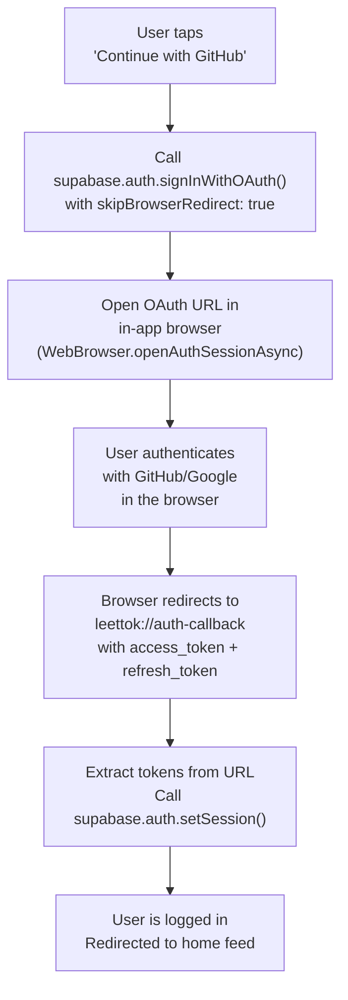

# OAuth Social Auth (GitHub + Google)

Add "Continue with GitHub" and "Continue with Google" buttons to the login and registration screens. For a dev-focused app like LeetTok, GitHub login is practically expected.

---

## How It Works on React Native

Supabase OAuth on mobile uses a **browser-based redirect flow** -- not a native SDK. The sequence is:




Key constraint: **This requires a development build** (not Expo Go) because Expo Go doesn't support custom URL schemes.

---

## Phase 1: Dependencies + Configuration

### Commit 1: Install expo-auth-session and expo-web-browser

```bash
npx expo install expo-auth-session expo-crypto expo-web-browser
```

- `expo-auth-session`: Generates redirect URIs, parses callback params
- `expo-crypto`: Required peer dependency for auth session
- `expo-web-browser`: Opens the OAuth provider's login page in an in-app browser

### Commit 2: Configure deep linking scheme

In [app.json](app.json), add a URL scheme so the OS knows how to redirect back to our app:

```json
{
  "expo": {
    "scheme": "leettok"
  }
}
```

Then add the redirect URL in the Supabase dashboard:

- Go to **Authentication > URL Configuration > Redirect URLs**
- Add: `leettok://`**

This tells Supabase that `leettok://` is a valid redirect target after OAuth completes.

### Commit 3: Enable GitHub and Google providers in Supabase

In the Supabase dashboard under **Authentication > Providers**:

**GitHub:**

1. Create an OAuth App at [https://github.com/settings/developers](https://github.com/settings/developers)
2. Set the Authorization callback URL to: `https://<project-ref>.supabase.co/auth/v1/callback`
3. Copy the Client ID and Client Secret into Supabase's GitHub provider settings

**Google:**

1. Create OAuth credentials in the Google Cloud Console
2. Use the **Web** client ID type (not Android/iOS -- this is critical for React Native)
3. Add `https://<project-ref>.supabase.co/auth/v1/callback` as an authorized redirect URI
4. Copy the Client ID and Client Secret into Supabase's Google provider settings

Store nothing in the app code -- all secrets live in Supabase's server-side config.

---

## Phase 2: OAuth Flow Implementation

### Commit 4: Build OAuth helper functions

Create `src/lib/oauth.ts`:

```typescript
import { makeRedirectUri } from "expo-auth-session";
import * as QueryParams from "expo-auth-session/build/QueryParams";
import * as WebBrowser from "expo-web-browser";
import * as Linking from "expo-linking";
import { supabase } from "./supabase";

WebBrowser.maybeCompleteAuthSession();

const redirectTo = makeRedirectUri();

export async function createSessionFromUrl(url: string) {
  const { params, errorCode } = QueryParams.getQueryParams(url);
  if (errorCode) throw new Error(errorCode);

  const { access_token, refresh_token } = params;
  if (!access_token) return null;

  const { data, error } = await supabase.auth.setSession({
    access_token,
    refresh_token,
  });
  if (error) throw error;
  return data.session;
}

export async function signInWithProvider(
  provider: "github" | "google"
): Promise<string | null> {
  try {
    const { data, error } = await supabase.auth.signInWithOAuth({
      provider,
      options: {
        redirectTo,
        skipBrowserRedirect: true,
      },
    });
    if (error) return error.message;

    const res = await WebBrowser.openAuthSessionAsync(
      data.url,
      redirectTo
    );

    if (res.type === "success") {
      await createSessionFromUrl(res.url);
      return null;
    }

    return res.type === "cancel" ? null : "Authentication failed";
  } catch (err: any) {
    return err.message ?? "An unexpected error occurred";
  }
}
```

This is the exact pattern from [Supabase's official Expo social auth docs](https://supabase.com/docs/guides/auth/native-mobile-deep-linking).

### Commit 5: Add deep link listener for email magic links

In [src/lib/auth.tsx](src/lib/auth.tsx), add a `Linking.useURL()` listener so that if the app is opened via a deep link (e.g., from a password reset email or magic link), the session is created automatically:

```typescript
import * as Linking from "expo-linking";
import { createSessionFromUrl } from "./oauth";

// Inside AuthProvider:
const url = Linking.useURL();
useEffect(() => {
  if (url) createSessionFromUrl(url);
}, [url]);
```

---

## Phase 3: Redesign Auth Screens

### Commit 6: Add social auth buttons to login screen

Update [app/auth/login.tsx](app/auth/login.tsx) to add GitHub and Google buttons above the existing email form. Layout inspired by TikTok's sign-in screen:

```
+----------------------------------+
|                                  |
|           LeetTok                |
|      Sign in to your account     |
|                                  |
|  [G  Continue with GitHub]       |  <-- dark button, GitHub octocat icon
|                                  |
|  [G  Continue with Google]       |  <-- white button, Google "G" icon
|                                  |
|  ----------- or -----------      |  <-- divider
|                                  |
|  [Email input                 ]  |
|  [Password input              ]  |
|  [       Sign In              ]  |
|                                  |
|  Don't have an account? Sign Up  |
+----------------------------------+
```

- GitHub button: dark background (#24292e), white Octocat icon + text
- Google button: white background, Google "G" logo, dark text
- Both call `signInWithProvider("github")` or `signInWithProvider("google")`
- Loading spinner replaces button text while OAuth is in progress
- Error display if OAuth fails

### Commit 7: Add social auth buttons to register screen

Same buttons on [app/auth/register.tsx](app/auth/register.tsx). With OAuth, signup and login are the same flow -- Supabase auto-creates the user on first OAuth login. So both screens can use `signInWithProvider()`.

Update the register screen layout to match login: social buttons on top, email form below with a divider.

### Commit 8: Add GitHub/Google icons

Either:

- Use `@expo/vector-icons` (Ionicons has `logo-github`, `logo-google`)
- Or bundle small SVG icons for pixel-perfect branding

Prefer `@expo/vector-icons` since it's already available in Expo and avoids extra dependencies.

---

## Phase 4: Testing + Edge Cases

### Commit 9: Switch to development build for testing

OAuth requires a dev build (Expo Go doesn't support custom URL schemes):

```bash
npx expo prebuild
npx expo run:ios   # or run:android
```

Test matrix:

- GitHub OAuth: login, first-time signup, re-login
- Google OAuth: login, first-time signup, re-login
- Email/password: still works alongside OAuth
- Cancel mid-flow: user closes browser without completing -- app handles gracefully
- Network error during OAuth: error message displayed

### Commit 10: Handle edge cases

- **User cancels OAuth flow**: `res.type === "cancel"` -- silently return to login screen, no error
- **Duplicate email**: If user signed up with email/password and then tries Google with the same email, Supabase can be configured to either link accounts or reject. Configure linking behavior in Supabase dashboard.
- **Token expiry during OAuth**: If the browser session takes too long, handle the timeout gracefully
- **Android back button**: Pressing back during the browser OAuth flow should cancel and return to login
- **setSession hang (known Google issue)**: Add a 15-second timeout wrapper around `setSession()` for Google OAuth specifically

---

## Files Changed


| File                    | Change                                               |
| ----------------------- | ---------------------------------------------------- |
| `package.json`          | Add expo-auth-session, expo-crypto, expo-web-browser |
| `app.json`              | Add `"scheme": "leettok"`                            |
| `src/lib/oauth.ts`      | New -- OAuth helper functions                        |
| `src/lib/auth.tsx`      | Add deep link listener                               |
| `app/auth/login.tsx`    | Add GitHub + Google buttons above email form         |
| `app/auth/register.tsx` | Add GitHub + Google buttons above email form         |


Plus Supabase dashboard configuration (not in code):

- Enable GitHub provider with OAuth app credentials
- Enable Google provider with web client ID
- Add `leettok://`** to redirect URLs

---

## Dependencies on Other Plans

- **Mobile App** ([leettok_mobile_app.plan.md](.cursor/plans/leettok_mobile_app.plan.md)): Phase 4 (Supabase backend + auth) must be complete. The existing `AuthProvider` and `supabase.ts` client are extended, not replaced.
- **Supabase project**: Must be created with auth enabled. GitHub and Google providers configured in the dashboard.

