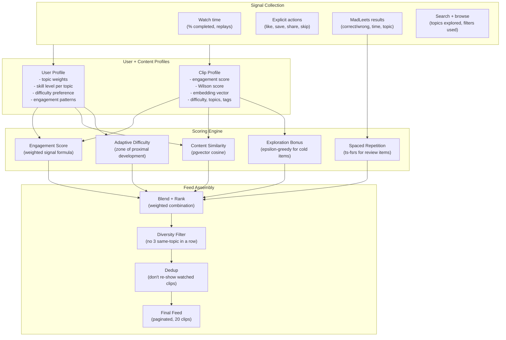

# LeetTok Recommendation Engine

## Why This Matters

The "For You" feed is the default landing screen. If it serves random clips, the app feels like a dumb playlist. If it serves the *right* clip at the *right* difficulty at the *right* time, it feels like magic -- and that's what makes TikTok addictive.

But we're not just TikTok. We're an *educational* app. TikTok optimizes for watch time (engagement). We need to optimize for **learning outcomes** -- which means sometimes showing you something *hard* that you need to practice, not just something easy and entertaining. This is the core tension the recommendation engine must balance.

---

## Architecture Overview



---

## What We Can Learn from TikTok

TikTok's Monolith system (published by ByteDance) is a real-time recommendation engine with online training. We obviously can't build Monolith, but we can steal the key ideas that work at small scale:

### Signal Hierarchy (adapted from TikTok's weighting)

TikTok's research shows not all engagement signals are equal. Adapted for LeetTok:

| Signal | TikTok Weight | LeetTok Weight | Why |
|--------|--------------|----------------|-----|
| **Watch completion %** | Highest | High | Did they watch the whole clip or swipe away? |
| **Share** | 5x likes | High | Sharing = "this helped me, others need this" |
| **Save/Bookmark** | High | High | "I need to come back to this" = high intent |
| **MadLeets correct** | N/A | **Highest** | Unique to us -- proves actual learning happened |
| **MadLeets wrong** | N/A | High (negative) | Shows the topic needs more practice |
| **Comment/Discuss** | Medium | Medium | Engagement, but less signal for learning |
| **Like** | Lowest explicit | Low | Weakest signal (low effort, low intent) |
| **Skip (swipe away <2s)** | Strong negative | Strong negative | "Not relevant to me" |
| **Replay** | High | High | "I need to see this again" = learning signal |

### The Interest Graph (not Social Graph)

Like TikTok, we rank clips by *content relevance*, not by who the creator is. A clip about "Kadane's Algorithm" should surface because the user needs it, not because they follow NeetCode. We don't even have a social graph at MVP -- every user sees content based on their own learning profile.

### Cold Start: Exploration Phase

TikTok shows new videos to 200-500 users first to test engagement. We do the same:
- New clips start with a small **exploration bonus** in the score
- After ~100 impressions, the bonus decays and the clip's real engagement score takes over
- This prevents new content from being buried and old popular content from dominating forever

---

## What We Add Beyond TikTok: Educational Intelligence

### Adaptive Difficulty (Zone of Proximal Development)

Duolingo's core insight: the best learning happens at "i+1" -- content just slightly beyond your current level. We implement this by:

1. **Estimating user skill per topic**: Track MadLeets accuracy and watch behavior per DSA topic (arrays, trees, DP, graphs, etc.)
2. **Mapping clips to difficulty**: Each clip has a difficulty rating (from the pipeline's LLM analysis)
3. **Targeting the frontier**: Prioritize clips where `clip.difficulty` is slightly above `user.skill[topic]`

Example: If a user is 80% accurate on array problems but 30% on DP problems, the feed should surface more medium-difficulty DP clips (not easy ones -- that's boring; not hard ones -- that's frustrating).

### Spaced Repetition (ts-fsrs)

Using the open-source `ts-fsrs` library (v5.2.3, 27K weekly npm downloads):
- Problems the user got wrong in MadLeets enter a review schedule
- FSRS calculates optimal review intervals based on difficulty, stability, and retrievability
- Review items get a boost in the feed score when they're "due"
- This turns the For You feed into a smart flashcard system without the user realizing it

---

## Phase 1: Signal Collection (Instrumentation)

Before we can recommend anything, we need data. Instrument every user interaction.

### Commit 1: Create interactions table

```sql
create table interactions (
  id uuid primary key default gen_random_uuid(),
  user_id uuid references users(id) not null,
  clip_id uuid references clips(id) not null,
  interaction_type text not null,
  value jsonb,
  created_at timestamptz default now()
);

create index idx_interactions_user on interactions(user_id, created_at desc);
create index idx_interactions_clip on interactions(clip_id);
```

Interaction types and their `value` payloads:
- `watch`: `{ duration_ms, total_duration_ms, completed: bool, replayed: bool }`
- `like`: `{ liked: bool }`
- `save`: `{ saved: bool }`
- `share`: `{ method: "copy_link" | "message" | "other" }`
- `skip`: `{ watch_duration_ms }` (swiped away early)
- `madleets_attempt`: `{ correct: bool, time_taken_ms, challenge_id }`
- `search`: `{ query, filters }`
- `tap_problem`: `{ problem_id }` (tapped LeetCode badge)

### Commit 2: Add client-side event tracking

`src/lib/track.ts`:

- Lightweight tracking function called from the video feed and MadLeets UI
- Batches events locally, flushes to Supabase every 5 seconds or on app background
- Optimistic -- never blocks UI. Failed writes are retried on next flush.
- Records `watch` events with precise timing using the video player's `currentTime`

### Commit 3: Add impression tracking

- Record every clip impression (clip shown to user) with timestamp
- This is needed to calculate skip rate and to prevent re-showing the same clips
- Lightweight: just `(user_id, clip_id, shown_at)` in an `impressions` table

---

## Phase 2: Clip Scoring Engine

### Commit 4: Build engagement score calculator

`src/lib/scoring.ts` (runs on client for fast ranking, or as Supabase Edge Function for server-side):

Each clip gets a composite engagement score:

```typescript
function engagementScore(clip: ClipStats): number {
  const w = {
    completionRate: 3.0,
    saveRate: 2.5,
    shareRate: 2.5,
    madleetsCorrectRate: 3.0,
    replayRate: 2.0,
    likeRate: 1.0,
    skipRate: -3.0,
    commentRate: 1.5,
  };

  return (
    clip.avgCompletionRate * w.completionRate +
    clip.saveRate * w.saveRate +
    clip.shareRate * w.shareRate +
    clip.madleetsCorrectRate * w.madleetsCorrectRate +
    clip.replayRate * w.replayRate +
    clip.likeRate * w.likeRate +
    clip.skipRate * w.skipRate +
    clip.commentRate * w.commentRate
  );
}
```

Precompute and cache this score per clip (update hourly via pg_cron or on significant change).

### Commit 5: Add freshness decay

Clips lose score over time so the feed doesn't get stale:

```typescript
function freshnessMultiplier(createdAt: Date): number {
  const ageHours = (Date.now() - createdAt.getTime()) / 3600000;
  // Half-life of 7 days (168 hours)
  return Math.pow(0.5, ageHours / 168);
}
```

Final clip score = `engagementScore * freshnessMultiplier`

### Commit 6: Add Wilson score for Trending tab

The Trending tab needs to rank clips by engagement rate, but a clip with 2 likes / 2 views (100%) shouldn't beat one with 500 likes / 1000 views (50%). Wilson score handles this:

```typescript
function wilsonScore(positive: number, total: number, z = 1.96): number {
  if (total === 0) return 0;
  const p = positive / total;
  return (
    (p + (z * z) / (2 * total) -
      z * Math.sqrt((p * (1 - p) + (z * z) / (4 * total)) / total)) /
    (1 + (z * z) / total)
  );
}
```

Use `wilsonScore(saves + shares, impressions)` for trending ranking (saves + shares are the strongest positive signals).

---

## Phase 3: User Interest Profile

### Commit 7: Build user profile aggregation

`user_profiles` table (materialized from interactions):

```sql
create table user_profiles (
  user_id uuid references users(id) primary key,
  topic_weights jsonb default '{}',
  difficulty_preference text default 'medium',
  skill_levels jsonb default '{}',
  engagement_pattern jsonb default '{}',
  updated_at timestamptz default now()
);
```

- `topic_weights`: `{ "arrays": 0.85, "trees": 0.45, "dp": 0.2, "graphs": 0.6 }` -- how much the user engages with each topic (0-1 scale)
- `skill_levels`: `{ "arrays": 0.7, "trees": 0.3, "dp": 0.1 }` -- estimated mastery per topic based on MadLeets accuracy
- `difficulty_preference`: inferred from which difficulty clips the user watches longest
- `engagement_pattern`: time of day, session length, etc.

### Commit 8: Build profile update logic

Supabase Edge Function or pg_cron job that runs every hour:

- Aggregate last 30 days of interactions per user
- Calculate topic weights from watch time distribution across topics
- Calculate skill levels from MadLeets accuracy per topic
- Infer difficulty preference from completion rates by difficulty tier
- Write to `user_profiles` table

### Commit 9: Handle cold start (new users)

For users with < 10 interactions:
- Use the **onboarding selections** (difficulty preference + topic interests from the onboarding flow in the mobile app plan)
- Fall back to **global popularity** (highest Wilson score clips) blended with **topic diversity**
- Transition gradually: `personalizedScore * min(interactions/10, 1) + globalScore * max(1 - interactions/10, 0)`

---

## Phase 4: Content Embeddings (pgvector)

### Commit 10: Enable pgvector and add embedding column

```sql
create extension if not exists vector;

alter table clips add column embedding vector(384);
```

Using 384-dimensional vectors (Supabase's built-in `gte-small` model -- free, no external API needed).

### Commit 11: Generate embeddings for all clips

Supabase Edge Function that runs when a new clip is inserted:

- Input: clip title + transcript + topic tags + difficulty
- Generate embedding using Supabase's built-in AI inference (`Supabase.ai.Session`)
- Store in the `embedding` column
- Create HNSW index for fast similarity search:

```sql
create index on clips using hnsw (embedding vector_cosine_ops);
```

### Commit 12: Build content similarity function

Postgres function to find similar clips:

```sql
create or replace function similar_clips(query_embedding vector(384), limit_n int default 20)
returns table (clip_id uuid, similarity float) as $$
  select id, 1 - (embedding <=> query_embedding) as similarity
  from clips
  order by embedding <=> query_embedding
  limit limit_n;
$$ language sql;
```

For user-level similarity: average the embeddings of the user's last 20 liked/saved clips to create a "user taste vector", then find clips closest to it.

---

## Phase 5: Feed Assembly Algorithm

This is where everything comes together. The feed is assembled by scoring every candidate clip, then applying diversity and dedup filters.

### Commit 13: Build candidate generation

`src/lib/feed.ts`:

Two-stage approach (like TikTok's):

**Stage 1: Candidate Retrieval** (broad, fast, ~200 clips)
- Pull unseen clips (not in user's impressions for last 7 days)
- Filter by language and basic preferences
- Include clips from all topics (don't filter too aggressively)
- Include any spaced repetition "due" clips

**Stage 2: Scoring + Ranking** (precise, scored, top 20)
- Score each candidate with the blended formula (see commit 14)
- Apply diversity filter
- Return top 20 as a page of the feed

### Commit 14: Build the blended scoring formula

Each candidate clip gets a final score from multiple components:

```typescript
function finalScore(
  clip: Clip,
  user: UserProfile,
  context: FeedContext
): number {
  // 1. Base engagement (how good is this clip overall?)
  const engagement = clip.engagementScore * freshnessMultiplier(clip.createdAt);

  // 2. Personal relevance (does this match the user's interests?)
  const topicMatch = cosineSimilarity(user.topicWeights, clip.topicVector);

  // 3. Content similarity (is this like clips the user liked?)
  const contentSim = pgvectorSimilarity(user.tasteVector, clip.embedding);

  // 4. Adaptive difficulty (is this at the right challenge level?)
  const difficultyFit = adaptiveDifficultyScore(user.skillLevels, clip);

  // 5. Spaced repetition boost (is this clip "due" for review?)
  const reviewBoost = spacedRepetitionBoost(user, clip);

  // 6. Exploration bonus (is this a new/cold clip that needs exposure?)
  const exploration = explorationBonus(clip.impressionCount);

  // Weighted blend
  return (
    engagement * 0.25 +
    topicMatch * 0.20 +
    contentSim * 0.15 +
    difficultyFit * 0.20 +
    reviewBoost * 0.10 +
    exploration * 0.10
  );
}
```

The weights are the starting point -- we'll tune them based on real user data (Phase 7).

### Commit 15: Build diversity filter

Prevent monotonous feeds:

- No more than 2 consecutive clips on the same topic
- No more than 3 consecutive clips at the same difficulty
- At least 1 MadLeets-enabled clip in every 5 clips
- If user has due review items, inject 1 per 10 clips

Implementation: greedy re-ranking. Walk the sorted list, skip clips that violate diversity constraints, pull in the next valid clip.

### Commit 16: Build feed API endpoint

Supabase Edge Function: `GET /feed?cursor=...`

- Authenticates user from JWT
- Runs candidate generation + scoring + diversity filter
- Returns paginated response (20 clips per page)
- Includes precomputed metadata (engagement counts, MadLeets challenge availability)
- Caches scored feed for 5 minutes per user (don't re-rank on every scroll)

---

## Phase 6: Adaptive Difficulty + Spaced Repetition

### Commit 17: Build adaptive difficulty scoring

```typescript
function adaptiveDifficultyScore(
  skillLevels: Record<string, number>,
  clip: Clip
): number {
  const userSkill = skillLevels[clip.primaryTopic] ?? 0.5;
  const clipDifficulty = difficultyToNumber(clip.difficulty); // easy=0.3, medium=0.5, hard=0.8

  // Optimal: clip is slightly harder than user's skill (i+1)
  const gap = clipDifficulty - userSkill;

  // Bell curve centered at gap = +0.1 (slightly harder)
  // Peaks when clip is just above user's level
  // Falls off for too-easy (boring) or too-hard (frustrating)
  return Math.exp(-Math.pow((gap - 0.1) / 0.3, 2));
}
```

This creates a Gaussian curve that peaks when the clip is ~10% harder than the user's current skill in that topic -- the "zone of proximal development."

### Commit 18: Integrate ts-fsrs for spaced repetition

```bash
npm install ts-fsrs
```

`src/lib/spaced-repetition.ts`:

- When a user gets a MadLeets challenge wrong, create an FSRS card for that clip/problem
- FSRS tracks: stability, difficulty, elapsed days, scheduled days, reps, lapses, state
- On each feed generation, check which cards are "due" (retrievability < 0.9)
- Due cards get a `reviewBoost` added to their score in the feed formula
- When user watches a due clip and attempts the MadLeets challenge again, update the FSRS card with the new rating

FSRS card ratings mapped to MadLeets outcomes:
- Correct on first try -> `Rating.Easy` (long interval before next review)
- Correct with hint -> `Rating.Good` (medium interval)
- Wrong but close (fuzzy match) -> `Rating.Hard` (short interval)
- Wrong -> `Rating.Again` (review soon)

### Commit 19: Build skill level estimator

Update `user.skillLevels[topic]` after each MadLeets attempt:

```typescript
function updateSkillLevel(
  currentSkill: number,
  correct: boolean,
  clipDifficulty: number
): number {
  const alpha = 0.1; // learning rate
  const target = correct ? clipDifficulty : clipDifficulty * 0.5;
  // Exponential moving average toward demonstrated ability
  return currentSkill + alpha * (target - currentSkill);
}
```

If user correctly answers a hard challenge, skill rises toward "hard" level. If they fail an easy challenge, skill drops. The EMA smooths out noise from individual attempts.

---

## Phase 7: Measurement + Iteration

### Commit 20: Build metrics tracking

Key metrics to track (stored in a `metrics` table, aggregated daily):

- **Learning metrics** (our North Star):
  - MadLeets accuracy rate (overall and per topic)
  - Problems mastered (correct on first attempt)
  - Skill level progression over time
- **Engagement metrics**:
  - Daily active users (DAU)
  - Session duration
  - Clips watched per session
  - Feed completion rate (how far users scroll)
  - Return rate (do they come back tomorrow?)
- **Feed quality metrics**:
  - Skip rate (% of clips swiped away in < 2 seconds)
  - Save rate
  - Share rate
  - MadLeets attempt rate (do users try the challenges?)

### Commit 21: Build simple A/B testing

- Store feed algorithm variant per user in `user_profiles.experiment_group`
- Assign new users randomly to groups (50/50 split)
- Log which variant generated each feed page
- Compare metrics between groups after 7 days
- Start with: "engagement-only scoring" vs "engagement + adaptive difficulty" to validate that the educational layer improves retention

### Commit 22: Tune weights based on data

After 2-4 weeks of data:
- Analyze which scoring weights produce the best learning outcomes + retention
- Adjust the blend formula weights in commit 14
- Iterate on the adaptive difficulty curve (commit 17)
- Consider per-user weight personalization if data supports it

---

## Per-Tab Feed Strategies

Each top category tab uses a different subset of the scoring engine:

| Tab | Strategy |
|-----|----------|
| **For You** | Full blended algorithm (engagement + personal relevance + adaptive difficulty + spaced repetition + exploration) |
| **MadLeets** | Same as For You, but filtered to clips with MadLeets challenges. Heavier weight on `adaptiveDifficultyScore` and `reviewBoost`. |
| **NeetCode 150** | Ordered by the NeetCode 150 list sequence. Within a problem, rank clips by engagement score. Mark completed problems. |
| **Trending** | Ranked by Wilson score over last 7 days. No personalization. Same for all users. |
| **New** | Reverse chronological (newest first). No personalization. Minimal scoring (just dedup). |

---

## Tech Stack

| Component | Tool |
|-----------|------|
| Data storage | Supabase Postgres (interactions, profiles, impressions) |
| Vector similarity | pgvector extension (built into Supabase) |
| Embeddings | Supabase AI inference (`gte-small`, 384 dimensions, free) |
| Spaced repetition | `ts-fsrs` v5.2.3 (npm package, MIT license) |
| Feed generation | Supabase Edge Function (Deno, globally distributed) |
| Scheduled jobs | pg_cron (profile updates, engagement score refresh) |
| A/B testing | Custom (experiment_group column + metrics logging) |

---

## Scaling Notes

At MVP scale (< 10K users, < 5K clips), everything runs in Postgres:
- Candidate generation is a single SQL query with joins
- Scoring runs in a Supabase Edge Function (~50ms)
- pgvector similarity search on 5K items is instant (< 10ms)
- No need for Redis, Kafka, or separate ML infrastructure

If we hit 100K+ users, consider:
- Precomputing feed pages in a background job instead of real-time
- Moving to a dedicated vector database if pgvector latency increases
- Adding a simple collaborative filtering layer ("users similar to you also liked...")

---

## Dependencies on Other Plans

- **Mobile App** ([leettok_mobile_app.plan.md](.cursor/plans/leettok_mobile_app.plan.md)): Phase 4 (Supabase backend) must be complete. The feed API endpoint replaces the simple `clips.select(*)` query.
- **MadLeets** ([madleets_interactive_challenges.plan.md](.cursor/plans/madleets_interactive_challenges.plan.md)): MadLeets attempt data is a primary signal. The recommendation engine is significantly better with MadLeets data, but can function without it (engagement-only mode).
- **Clipping Engine** ([neetcode_clipping_engine.plan.md](.cursor/plans/neetcode_clipping_engine.plan.md)): Clip metadata (topics, difficulty, transcript) is used for embeddings and adaptive difficulty. The pipeline should tag clips with this data.
