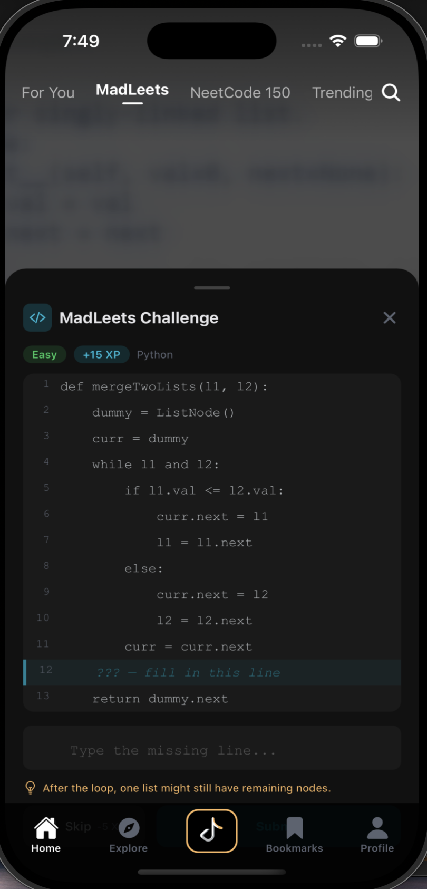

<div align="center">


# LeetTok

### Doomscroll your way to a job.

TikTok-style LeetCode walkthroughs you can't stop swiping.  
Solve problems right in the app. Build streaks. Land offers.

[](https://reactnative.dev)
[](https://expo.dev)
[](https://supabase.com)
[](https://typescriptlang.org)
[](LICENSE)

---

**The algorithm is addictive. The scroll is productive.**

[Get Started](#-getting-started) · [Features](#-features) · [Architecture](#-architecture) · [Pipeline](#-content-pipeline) · [Contributing](#-contributing)

</div>

---

## Product Preview

<table align="center">
  <tr>
    <td align="center" valign="middle" width="180">
      <h3>Stop<br>doomscrolling.</h3>
    </td>
    <td align="center" valign="middle">
      <a href="https://youtube.com/shorts/x4Kk_tTICfI?feature=share">
        
      </a>
      <br>
      <sub>Tap to watch the full demo</sub>
    </td>
    <td align="center" valign="middle" width="180">
      <h3>Start<br>doomsolving.</h3>
    </td>
  </tr>
</table>

<p align="center">
  
  
  
  
</p>

---

## The Problem

You open LeetCode. You stare at a problem. You alt-tab to YouTube. Two hours later, you've watched three vlogs, a cooking video, and zero algorithm explanations.

**LeetTok fixes this.** We took the most addictive UX pattern ever invented -- the infinite vertical feed -- and filled it with bite-sized LeetCode walkthroughs. Every swipe is progress. Every scroll session is interview prep.

## Why LeetTok?

| The Old Way | The LeetTok Way |
|---|---|
| Open LeetCode, feel overwhelmed | Open LeetTok, start swiping |
| Watch a 45-min YouTube tutorial | Watch a 60-second walkthrough |
| Read a solution, forget it tomorrow | Spaced repetition locks it in |
| Practice feels like a chore | Practice feels like a feed |

---

## Features

### Swipe to Learn
Full-screen, vertical-scroll video feed. Auto-play. Snap scroll. Exactly like TikTok, except every video makes you a better engineer.

### MadLeets
Fill-in-the-blank coding challenges that pop up *mid-video* at the exact moment a key concept is explained. You're not just watching -- you're solving.

### Smart Categories
**For You** · **NeetCode 150** · **Trending** · **New** · **MadLeets** -- curated feeds that adapt to where you are in your prep journey.

### Built-in Code Editor
See a problem you want to try? Solve it right in the app. No context-switching. No excuses.

### AI Tutor
Stuck on a concept? The in-app AI tutor breaks it down for you without leaving the feed.

### Explore by Topic
Browse problems by **Arrays**, **Trees**, **Graphs**, **Dynamic Programming**, and more. Filter by difficulty. Search by name.

### Streaks, XP & Progress
Daily streaks. XP for every problem watched and solved. Topic-level accuracy breakdowns. The dopamine loop that actually helps your career.

### Personalized Onboarding
Targeting FAANG? Top startups? Palantir? Tell us your goal and preferred topics -- we'll tailor the feed.

---

## Architecture

```
┌─────────────────────────────────────────────────────┐
│                    LeetTok App                       │
│                                                     │
│  ┌──────────┐  ┌──────────┐  ┌───────────────────┐ │
│  │  Feed /  │  │ Explore  │  │   MadLeets        │ │
│  │  Home    │  │          │  │   Challenges       │ │
│  └────┬─────┘  └────┬─────┘  └─────────┬─────────┘ │
│       │              │                  │           │
│  ┌────┴──────────────┴──────────────────┴─────────┐ │
│  │              expo-router (tabs)                 │ │
│  └────────────────────┬───────────────────────────┘ │
│                       │                             │
│  ┌────────────────────┴───────────────────────────┐ │
│  │    Supabase Client · Auth · Video Player       │ │
│  │    Spaced Repetition (ts-fsrs) · Analytics     │ │
│  └────────────────────┬───────────────────────────┘ │
└───────────────────────┼─────────────────────────────┘
                        │
          ┌─────────────┴─────────────┐
          │        Supabase           │
          │   Postgres · Auth · RLS   │
          └─────────────┬─────────────┘
                        │
          ┌─────────────┴─────────────┐
          │     Cloudflare R2         │
          │   Video Storage (CDN)     │
          └───────────────────────────┘
```

### Tech Stack

| Layer | Tech |
|---|---|
| **Framework** | Expo SDK 55 · React Native 0.83 · React 19 |
| **Language** | TypeScript 5.9 |
| **Navigation** | expo-router (file-based, typed routes) |
| **Styling** | NativeWind 5 · Tailwind CSS 4 |
| **Backend** | Supabase (Postgres, Auth, Row-Level Security) |
| **Video** | expo-video |
| **Spaced Repetition** | ts-fsrs |
| **Animations** | react-native-reanimated 4 · Gesture Handler |
| **Storage** | AsyncStorage · SecureStore |

---

## Content Pipeline

LeetTok's secret sauce: an automated Python pipeline that turns long-form NeetCode videos into perfectly-clipped, mobile-first short content.

```
YouTube ──▶ Discover ──▶ Download ──▶ Transcribe ──▶ Segment ──▶ Clip ──▶ Caption ──▶ Upload
              │              │            │              │           │          │          │
          YT Data API    yt-dlp     faster-whisper   GPT-4.1    FFmpeg    FFmpeg    R2 + Supabase
                                     / GPT-4o-mini   / Claude    9:16
                                                      Haiku    reframe
```

**Cost:** < $0.01 per video when YouTube captions exist. ~$0.02--0.05 with Whisper fallback.

See [`pipeline/README.md`](pipeline/README.md) for full documentation.

---

## Getting Started

### Quick Start

This repo is currently wired to a hosted Supabase project in `src/constants/config.ts`, so you do **not** need to create a `.env` file just to boot the app and explore the main flows.

#### Prerequisites

- [Node.js](https://nodejs.org/) 18+
- npm
- One of:
  - [Expo Go](https://expo.dev/go) on your phone
  - iOS Simulator
  - Android Emulator

#### Install and run

```bash
git clone https://github.com/mbron64/LeetTok.git
cd LeetTok

npm install

# Start Metro
npx expo start --clear
```

From there you can:

- press `i` to open the iOS Simulator
- press `a` to open Android
- scan the QR code with Expo Go for the fastest phone preview

#### What should work in quick start

- onboarding
- vertical feed browsing
- explore flows
- MadLeets feed behavior
- most UI and navigation flows
- hosted backend reads against the currently configured Supabase project

#### What may still need more setup

- Google OAuth and other native auth flows are more reliable in a development build than Expo Go
- end-to-end code execution depends on the deployed `run-code` function plus Judge0 availability
- AI tutor depends on the deployed tutor edge function and its server-side secrets

### Development Builds

If you want to run the native app instead of Expo Go:

```bash
npm run ios
# or
npm run android
```

This path is better for native modules, device testing, and OAuth.

### Full Maintainer Setup

Use this section if you want to change backend projects, deploy functions, or ship builds.

#### Client config

The mobile app currently reads its public Supabase project directly from:

- `src/constants/config.ts`

If you want the app to point at a different project, update that file.

#### Local secrets and backend work

You only need local secrets such as `.env` values when you are doing maintainer work like:

- configuring Google OAuth locally
- running or deploying Supabase edge functions
- managing backend service credentials
- preparing EAS/TestFlight submissions

#### EAS / TestFlight

EAS build profiles live in `eas.json`.

Typical commands:

```bash
npx eas build --platform ios --profile preview
npx eas submit --platform ios --profile production
```

That path is the right one when you want installable device builds instead of local Expo sessions.

## Project Structure

```
leettok/
├── app/                        # Screens (expo-router file-based routing)
│   ├── (tabs)/                 # Tab screens: Feed, Explore, MadLeets, Bookmarks, Profile
│   ├── auth/                   # Login & Register
│   ├── problem/[id].tsx        # Problem detail
│   ├── drill/[topic].tsx       # Topic drill-down
│   └── onboarding.tsx          # First-time experience
├── src/
│   ├── components/             # VideoFeed, VideoCard, CategoryBar, CodeEditor, etc.
│   ├── lib/                    # Auth, hooks, Supabase client, progress tracking, analytics
│   ├── constants/              # Config, theme, sample data
│   └── types/                  # TypeScript type definitions
├── pipeline/                   # Python content pipeline (discover → clip → upload)
├── supabase/                   # Edge functions
└── assets/images/              # App icons & splash
```

---

## Contributing

We welcome contributions! Whether it's a new feature, bug fix, or improvement to the content pipeline -- all PRs are appreciated.

1. Fork the repo
2. Create your branch (`git checkout -b feat/amazing-feature`)
3. Commit your changes (`git commit -m 'Add amazing feature'`)
4. Push to the branch (`git push origin feat/amazing-feature`)
5. Open a Pull Request

---

## License

Distributed under the MIT License. See `LICENSE` for details.

---

<div align="center">


**Stop doomscrolling. Start doomsolving.**

Built with sleepless nights, too much coffee, and the dream that interview prep doesn't have to suck.

</div>
