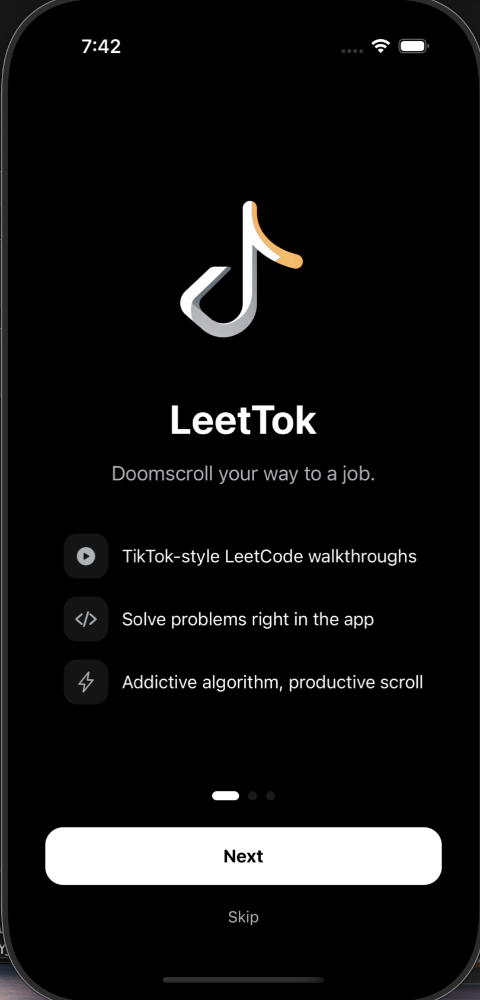
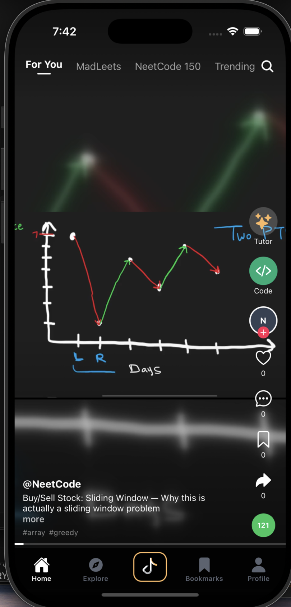
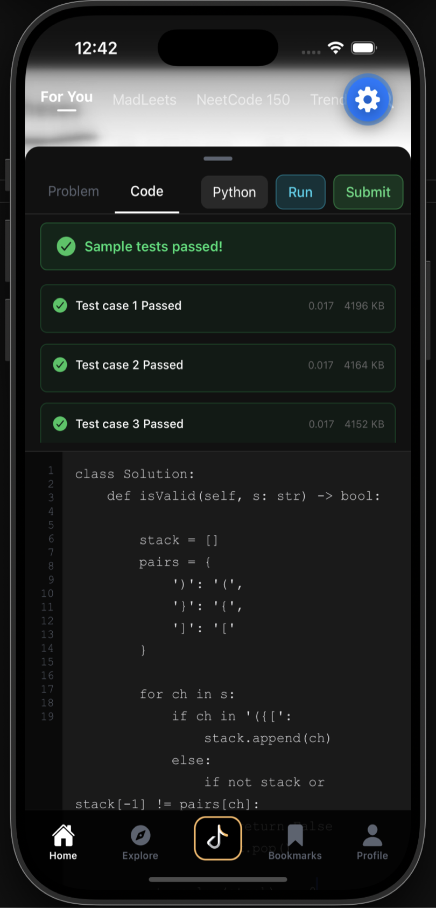
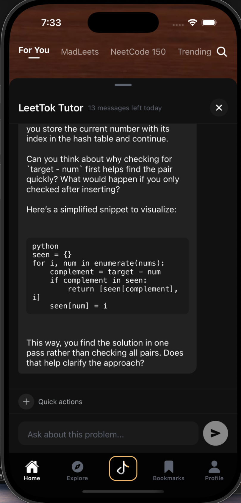

<div align="center">


# LeetTok

### Doomscroll your way to a job.

TikTok-style LeetCode clips you can't stop swiping.  
Solve problems right in the app. Build streaks. Get hired.

[](https://reactnative.dev)
[](https://expo.dev)
[](https://supabase.com)
[](https://typescriptlang.org)
[](LICENSE)

---

**The algorithm is addictive. The scroll is productive.**

[Get Started](#-getting-started) · [Features](#-features) · [Architecture](#-architecture) · [Pipeline](#-content-pipeline) · [Contributing](#-contributing)

</div>

---

## Product Preview

<table align="center">
  <tr>
    <td align="center" valign="middle" width="180">
      <h3>Stop<br>doomscrolling.</h3>
    </td>
    <td align="center" valign="middle">
      <a href="https://youtube.com/shorts/x4Kk_tTICfI?feature=share">
        
      </a>
      <br>
      <sub>Tap to watch the full demo</sub>
    </td>
    <td align="center" valign="middle" width="180">
      <h3>Start<br>doomsolving.</h3>
    </td>
  </tr>
</table>

<p align="center">
  
  
  
  
  
</p>

---

## The Problem

I deleted TikTok and Instagram but was still itching for a scroll. LeetCode prep is stuck on desktop. You need a laptop, a browser, and a chunk of free time. Why isn't there a feed I can open on my phone that's actually making me better at interviews?

So we built one. Video walkthroughs, a code editor, an AI tutor, all in a vertical feed you can open anywhere.

## Why LeetTok?

| Without LeetTok | With LeetTok |
|---|---|
| Need a laptop open | Pull out your phone |
| Long-form YouTube tutorials | 60-second clips |
| Only works when you sit down to grind | Works in any dead time |
| Can't code on your phone | Built-in mobile code editor |

---

## Features

### Swipe to Learn
Full-screen vertical video feed. Auto-play, snap scroll. Same UX as TikTok, but every video is a LeetCode walkthrough.

### MadLeets
Fill-in-the-blank coding challenges that pop up *mid-video* right when a key concept is explained. You're not watching, you're solving.

### Smart Categories
**For You** · **NeetCode 150** · **Trending** · **New** · **MadLeets**. Curated feeds based on where you are in your prep.

### Built-in Code Editor
See a problem you want to try? Solve it right in the app. Never leave the feed.

### AI Tutor
Stuck? Ask the in-app AI tutor. It breaks down the concept without taking you out of the flow.

### Explore by Topic
Browse by **Arrays**, **Trees**, **Graphs**, **DP**, and more. Filter by difficulty. Search by name.

### Streaks, XP & Progress
Daily streaks. XP for every problem watched and solved. Topic-level accuracy breakdowns. The dopamine loop that actually helps your career.

### Personalized Onboarding
Targeting FAANG? Top startups? Palantir? Tell us your goal and we tailor the feed.

---

## Architecture

```
┌─────────────────────────────────────────────────────┐
│                     LeetTok App                     │
│                                                     │
│  ┌──────────┐  ┌──────────┐  ┌───────────────────┐  │
│  │ Feed /   │  │ Explore  │  │ MadLeets          │  │
│  │ Home     │  │          │  │ Challenges        │  │
│  └────┬─────┘  └────┬─────┘  └────────┬──────────┘  │
│       │             │                 │             │
│  ┌────┴─────────────┴─────────────────┴───────────┐ │
│  │               expo-router (tabs)               │ │
│  └───────────────────────┬────────────────────────┘ │
│                          │                          │
│  ┌───────────────────────┴────────────────────────┐ │
│  │     Supabase Client · Auth · Video Player      │ │
│  │    Spaced Repetition (ts-fsrs) · Analytics     │ │
│  └───────────────────────┬────────────────────────┘ │
└──────────────────────────┼──────────────────────────┘
                           │
             ┌─────────────┴─────────────┐
             │          Supabase         │
             │   Postgres · Auth · RLS   │
             └─────────────┬─────────────┘
                           │
             ┌─────────────┴─────────────┐
             │       Cloudflare R2       │
             │    Video Storage (CDN)    │
             └───────────────────────────┘
```

### Tech Stack

| Layer | Tech |
|---|---|
| **Framework** | Expo SDK 55 · React Native 0.83 · React 19 |
| **Language** | TypeScript 5.9 |
| **Navigation** | expo-router (file-based, typed routes) |
| **Styling** | NativeWind 5 · Tailwind CSS 4 |
| **Backend** | Supabase (Postgres, Auth, Row-Level Security) |
| **Video** | expo-video |
| **Spaced Repetition** | ts-fsrs |
| **Animations** | react-native-reanimated 4 · Gesture Handler |
| **Storage** | AsyncStorage · SecureStore |

---

## Content Pipeline

Automated Python pipeline that takes long-form NeetCode videos and chops them into mobile-first short clips.

```
YouTube ──▶ Discover ──▶ Download ──▶ Transcribe ──▶ Segment ──▶ Clip ──▶ Caption ──▶ Upload
              │              │            │              │           │          │          │
          YT Data API    yt-dlp     faster-whisper  GPT-4.1-mini  FFmpeg    FFmpeg    R2 + Supabase
                                     / GPT-4o-mini   / Claude      9:16
                                                      Haiku    reframe
```

**Cost:** Low cost per clip, especially when YouTube captions are available.

See [`pipeline/README.md`](pipeline/README.md) for full documentation.

---

## Getting Started

### Quick Start

The repo is already wired to a hosted Supabase project in `src/constants/config.ts`. No `.env` needed to boot it up.

#### Prerequisites

- [Node.js](https://nodejs.org/) 18+
- npm
- One of:
  - [Expo Go](https://expo.dev/go) on your phone
  - iOS Simulator
  - Android Emulator

#### Install and run

```bash
git clone https://github.com/mbron64/LeetTok.git
cd LeetTok

npm install

# Start Metro
npx expo start --clear
```

From there you can:

- press `i` to open the iOS Simulator
- press `a` to open Android
- scan the QR code with Expo Go for the fastest phone preview

#### What works out of the box

- Onboarding, feed browsing, explore, MadLeets, all core UI/navigation
- Reads from the hosted Supabase project

#### What needs more setup

| Feature | What you need | Env var |
|---|---|---|
| Google OAuth | Dev build (not Expo Go) + Supabase auth config | `GOOGLE_CLIENT_ID`, `GOOGLE_CLIENT_SECRET` |
| Code execution | Deployed `run-code` edge function + Judge0 instance | `JUDGE0_URL`, `JUDGE0_AUTH_TOKEN` |
| AI tutor | Deployed `chat-tutor` edge function + OpenAI key | `OPENAI_API_KEY` |

See [`.env.example`](.env.example) for the full list.

### Dev Builds

For native modules, device testing, and OAuth, run the native app instead of Expo Go:

```bash
npm run ios
# or
npm run android
```

### Full Maintainer Setup

Only needed if you're swapping backend projects, deploying functions, or shipping builds.

1. Copy `.env.example` to `.env` and fill in the values.
2. **Client config:** App reads its Supabase project from `src/constants/config.ts`. Change that file to point at a different project.
3. **Edge function secrets:** Set via `supabase secrets set` (see `.env.example` for the full list).
4. **EAS / TestFlight:** Build profiles live in `eas.json`.

```bash
npx eas build --platform ios --profile preview
npx eas submit --platform ios --profile production
```

## Project Structure

```
leettok/
├── app/                        # Screens (expo-router file-based routing)
│   ├── (tabs)/                 # Tab screens: Feed, Explore, MadLeets, Bookmarks, Profile
│   ├── auth/                   # Login & Register
│   ├── problem/[id].tsx        # Problem detail
│   ├── drill/[topic].tsx       # Topic drill-down
│   └── onboarding.tsx          # First-time experience
├── src/
│   ├── components/             # VideoFeed, VideoCard, CategoryBar, CodeEditor, etc.
│   ├── lib/                    # Auth, hooks, Supabase client, progress tracking, analytics
│   ├── constants/              # Config, theme, sample data
│   └── types/                  # TypeScript type definitions
├── pipeline/                   # Python content pipeline (discover → clip → upload)
├── supabase/                   # Edge functions
└── assets/images/              # App icons & splash
```

---

## Contributing

PRs welcome. Fork it, branch it, ship it.

```
git checkout -b feat/your-thing
git commit -m 'Add your thing'
git push origin feat/your-thing
```

Then open a PR.

---

## License

Distributed under the MIT License. See `LICENSE` for details.

---

<div align="center">


**Stop doomscrolling. Start doomsolving.**

Built at HackBU 2026.

</div>
